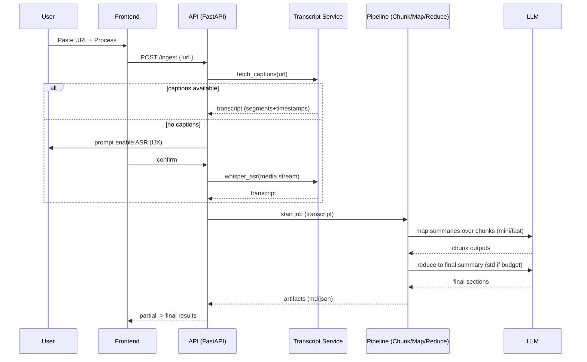
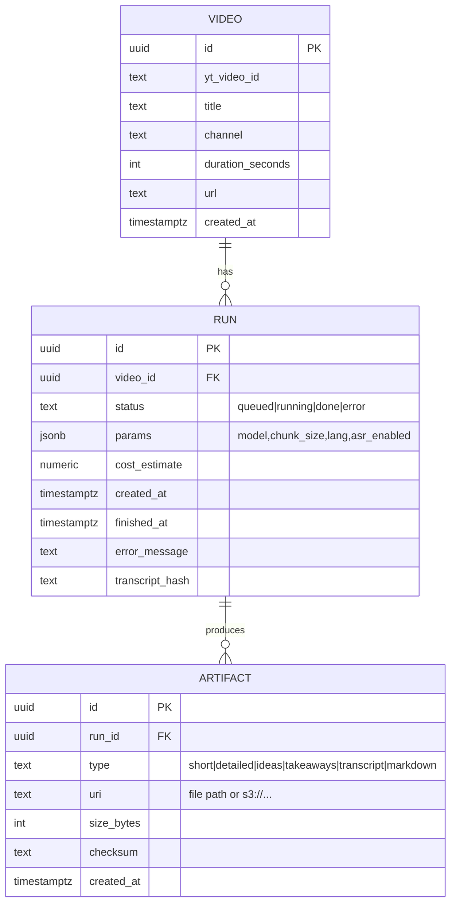
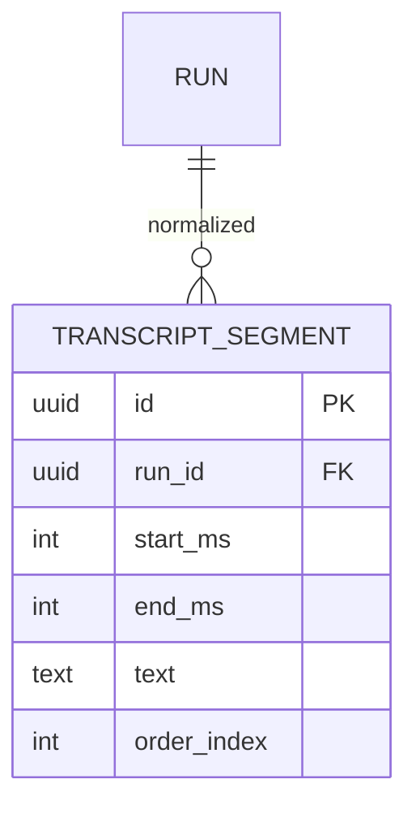

# MindTube — Technical Design Document (MVP, Lightweight)

**Version:** 2025‑07‑26 (JST)  
**Owner:** You (PM/Builder)

---

## 1. Architecture Overview

### 1.1 High‑level Diagram

```mermaid
flowchart LR
  U[User (Web)] --> FE[Next.js/React (TS)]
  FE -->|POST /ingest URL| API[FastAPI (Python)]
  API --> Q[Async Job Queue (in‑proc or worker)]
  Q --> T[Transcript Service]
  T -->|A| YT[YouTube Data/Captions API]
  T -->|B (fallback)| ASR[Whisper ASR]
  Q --> S[Summarizer Pipeline]
  S --> LLM[LLM Provider(s)]
  S --> C[Cache (hash(video+params))]
  S --> ST[(Storage: artifacts)]
  API --> DB[(DB: runs & metadata)]
  API -->|SSE/poll| FE
  ST --> FE
```

**Notes:**
- Progressive results: API streams or polls partial output (short summary) before final reduce.
- Cache key: `yt_video_id + transcript_hash + model_params` prevents recomputation.
- Storage: local filesystem for solo use; S3‑compatible bucket optional.

### 1.2 Core Pipeline (Sequence)



---

## 2. Technology Stack

### 2.1 Frontend

- **Next.js** (React, TypeScript)
  - Pros: fast DX, file‑based routing, SSR/SSG if needed; your stack familiarity.
  - Components: URL form, progress, tabs, transcript search, Markdown export.

### 2.2 Backend

- **FastAPI** (Python 3.11+)
  - Pros: async I/O, clean type hints, easy background tasks, Python ecosystem for ASR.
  - Endpoints:
    - `POST /ingest` → returns job_id
    - `GET /status/{job_id}` → { state, progress, eta }
    - `GET /result/{job_id}` → JSON + artifact links
    - (Optional) `GET /stream/{job_id}` (SSE) for live updates

### 2.3 Job/Workers

- **Option A (simplest, solo):** in‑process asyncio background tasks (FastAPI BackgroundTasks).
- **Option B (scalable):** RQ/Celery/Arq worker + Redis. (Pick Arq for lightweight asyncio + Redis.)

### 2.4 Data & Storage

- **DB:**
  - SQLite for single‑user local.
  - PostgreSQL (Neon/Supabase) for cloud.
- **Object Storage:** local disk for artifacts (markdown/transcript JSON); MinIO/S3 if cloud.

### 2.5 LLM Providers

- **Map (chunk):** a fast/mini model to reduce cost/latency.
- **Reduce (final):** a standard model when within budget; else stick to mini.
- **Justification:** hierarchical summarization preserves quality with lower token spend.

### 2.6 ASR (fallback)

- **OpenAI Whisper** (small/medium) via faster-whisper for speed.
- **Guardrails:** hard cap on duration (e.g., ≤120 min), configurable.

### 2.7 Why this stack?

- Speed to MVP: FastAPI + Python tooling for transcripts/ASR is frictionless.
- Cost control: model tiering + caching + chunked map/reduce.
- Maintainability: clear separation FE/API/Worker; easy to grow to Redis/S3 later.

---

## 3. Key Integrations

- **YouTube Data API v3**
  - Use: resolve video_id, get title, channel, duration, and check captions availability.
  - Alt/Adjunct: community youtube-transcript-api (verify ToS). Prefer official APIs.

- **LLM Provider(s)**
  - Use: map & reduce summarization, formatting to Markdown, timestamp insertion guidance.
  - Pattern: provider‑agnostic wrapper with retry/backoff, token budgeting.

- **ASR (Whisper)**
  - Use: when captions unavailable and user opts‑in.
  - Note: avoid downloading full video; transcode audio stream within ToS constraints.

- **(Post‑MVP) Notion API**
  - Use: export to a selected database/page.

---

## 4. Database Schema (Basic, MVP)

If you run local‑only, you can skip DB and store artifacts on disk with a JSON index.  
For cloud or reliability, use Postgres schema below.

### 4.1 ER Diagram (MVP)



### 4.2 Optional Tables (if you store transcript segments/search)



### 4.3 Suggested Postgres DDL (trim as needed)

```sql
CREATE TABLE video (
  id              uuid PRIMARY KEY DEFAULT gen_random_uuid(),
  yt_video_id     text NOT NULL,
  title           text,
  channel         text,
  duration_seconds integer,
  url             text NOT NULL,
  created_at      timestamptz NOT NULL DEFAULT now()
);
CREATE UNIQUE INDEX ux_video_yt ON video(yt_video_id);

CREATE TABLE run (
  id               uuid PRIMARY KEY DEFAULT gen_random_uuid(),
  video_id         uuid NOT NULL REFERENCES video(id) ON DELETE CASCADE,
  status           text NOT NULL CHECK (status IN ('queued','running','done','error')),
  params           jsonb NOT NULL DEFAULT '{}'::jsonb,
  cost_estimate    numeric(10,4),
  transcript_hash  text,
  error_message    text,
  created_at       timestamptz NOT NULL DEFAULT now(),
  finished_at      timestamptz
);
CREATE INDEX ix_run_video ON run(video_id);
CREATE INDEX ix_run_status ON run(status);

CREATE TABLE artifact (
  id          uuid PRIMARY KEY DEFAULT gen_random_uuid(),
  run_id      uuid NOT NULL REFERENCES run(id) ON DELETE CASCADE,
  type        text NOT NULL,
  uri         text NOT NULL,
  size_bytes  integer,
  checksum    text,
  created_at  timestamptz NOT NULL DEFAULT now()
);
CREATE INDEX ix_artifact_run ON artifact(run_id);
```

---

## 5. API Surface (MVP)

### POST /ingest

**Body:**  
```json
{ "url": "https://youtube.com/watch?v=..." , "asr": false, "lang": "auto" }
```

**Response:**  
```json
{ "job_id": "<uuid>" }
```

### GET /status/{job_id}

**Response:**  
```json
{ "status":"running", "progress":{"stage":"summarizing","pct":62}, "eta_seconds": 18 }
```

### GET /result/{job_id}

**Response:**  
```json
{
  "video": { "title":"...", "channel":"...", "duration": 754, "url":"..." },
  "sections": {
    "short": "...",
    "detailed": ["...","..."],
    "ideas": [["00:45","..."],["02:15","..."]],
    "takeaways": ["...","..."]
  },
  "links": {
    "markdown": "s3://.../file.md",
    "transcript_json": "s3://.../transcript.json"
  }
}
```

### (Optional) GET /stream/{job_id} (SSE)

- Events: progress, partial_summary, final.

---

## 6. Processing Details

- **Transcript normalization**
  - Segment granularity: ~5–15 seconds; keep start_ms/end_ms and raw text.
  - `transcript_hash = sha256(json_normalized_segments)` for caching.

- **Chunking**
  - Token‑aware chunk size ≈ 1.5–2k tokens; 100–200 token overlap.

- **Map stage (mini/fast)**
  - Prompt returns JSON: `{ key_ideas[], takeaways[], summary }`.

- **Reduce stage (std if budget)**
  - Consolidate, dedupe, order by time, inject timestamps (±5s tolerance).

- **Budget guardrails**
  - Hard cap tokens/run; on breach → degrade gracefully (fewer bullets, skip reduce upgrade).

---

## 7. Deployment (Minimum friction)

- **Local (recommended first):**
  - `docker-compose.yml` with services: frontend, api, postgres (optional), minio (optional).
  - Or no DB: write artifacts to `./data/artifacts` and a `runs.json` index.

- **Small cloud:**
  - Render/Fly/Hetzner VPS:
    - frontend (Next.js)
    - api (FastAPI + worker)
    - postgres: Neon/Supabase
    - storage: R2/S3 (optional)

- **Environment variables:**

```ini
YOUTUBE_API_KEY=...
LLM_PROVIDER=openai|anthropic|...
LLM_MODEL_MAP=mini_model_name
LLM_MODEL_REDUCE=standard_model_name
ASR_ENABLE=true|false
ARTIFACT_BUCKET=s3://bucket/path or ./data/artifacts
DATABASE_URL=postgres://...
```

---

## 8. Key Risks & Mitigations

- **YouTube ToS / captions availability:** prefer official APIs; show ASR opt‑in UX; never store audio by default.
- **Cost creep:** map on mini; reduce on std only if budget allows; cache aggressively.
- **Latency:** early partial summary; stream progress; adjust chunk size by duration.
- **Quality drift:** maintain a 10–15 video golden set for regression checks.

---

## 9. Minimal Implementation Checklist

- Next.js UI with URL -> progress -> tabs + Markdown export
- FastAPI /ingest, /status, /result with background task
- Transcript fetch (YouTube) + normalizer; ASR toggle stub
- Chunk → map (mini) → reduce (std/mini) → artifacts
- Local cache by transcript_hash + params
- Basic logs (latency, token est., errors)

