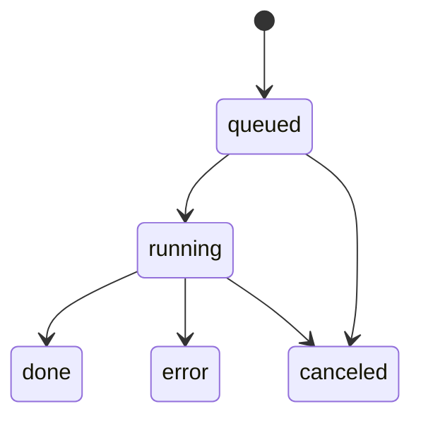

# MindTube — Backend Design (MVP)

**File:** /docs/backend-design.md  
**Version:** v0.1 (2025‑07‑26, JST)  
**Owner:** You (PM/Builder)

> Scope: Backend for ingesting a YouTube URL, producing **Summary / Key Ideas / Takeaways / Transcript** with timestamp links, and returning artifacts via a simple API. Optimized for a **solo developer MVP** with a clear path to scale.

---

## 1) Goals & Non‑Goals

**Goals**
- Minimal, reliable API to orchestrate: URL ingest → transcript → summarize → artifacts.
- Progressive results (partial short summary) and predictable latency/cost.
- Caching/idempotency to avoid recomputation.

**Non‑Goals (MVP)**
- Full auth/multi‑tenant features, rich RBAC, billing, or long‑term storage.
- Heavy infra (Kafka, complex workflow engines).

---

## 2) Architecture Overview

```mermaid
flowchart LR
  FE[Next.js Frontend] -->|POST /ingest| API[FastAPI]
  API --> Q[Async Job Runner (BackgroundTasks or Arq/Redis)]
  Q --> T[Transcript Service]
  T -->|A| YT[(YouTube Captions/Data API)]
  T -->|B (opt‑in)| ASR[(Whisper ASR)]
  Q --> S[Summarization Service]
  S --> LLM[(LLM Provider: mini/std)]
  S --> C[(Cache: video_id + transcript_hash + params)]
  Q --> ST[(Artifact Store: JSON/MD)]
  API --> DB[(DB: runs/artifacts) *optional*]
  API -->|poll/SSE| FE
```

**Data flow (happy path)**
1. `POST /ingest` with `{ url, asr?, lang? }` → create job.
2. Fetch captions → normalize → chunk map/reduce → artifacts (JSON, .md).
3. `GET /status/{job_id}`: progress (stage, pct, ETA).
4. `GET /result/{job_id}`: sections & links; cache reused when possible.

**State machine**


---

## 3) Technology Choices

- **FastAPI (Python 3.11+)**: async I/O, Pydantic models, easy background tasks.
- **Job runner**
  - MVP: `BackgroundTasks` + asyncio + semaphore.
  - Scale path: **Arq + Redis** (same code behind an abstract `JobQueue`).
- **Storage**
  - Artifacts on local disk `./data/artifacts` (MVP); swappable to S3/R2 via `ArtifactStore` interface.
  - DB optional (SQLite/Postgres) — or JSON index for solo use.
- **LLM provider**: mini model for map; std for reduce when budget allows (via provider‑agnostic client).
- **ASR**: `faster-whisper` (opt‑in), duration‑capped.

---

## 4) Module Layout

```
backend/
  app.py                     # FastAPI app, routes, lifespan
  api/
    routes_ingest.py
    routes_status.py
    routes_result.py
    errors.py                # HTTPException helpers, error codes
    schemas.py               # Pydantic request/response
  core/
    config.py                # Pydantic BaseSettings
    logging.py               # structlog or stdlib JSON logs
    queue.py                 # BackgroundTasks / Arq adapter
    state.py                 # job state machine
  domain/
    youtube.py               # YouTube client + caption check
    transcript.py            # normalize captions → segments
    asr.py                   # Whisper pipeline (optional)
    chunking.py              # token-aware chunker
    llm_client.py            # provider wrapper + budget
    summarize.py             # map/reduce orchestrator
    timestamps.py            # mm:ss / hh:mm:ss helpers
    cache.py                 # lookup by (video_id, hash, params)
    artifacts.py             # write/read JSON + Markdown
  data/
    models.py                # ORM models (optional)
    repo.py                  # repo interfaces (video/run/artifact)
```

---

## 5) API Contracts (Pydantic)

```python
# api/schemas.py
from pydantic import BaseModel, HttpUrl, Field
from typing import List, Tuple, Optional, Dict

class IngestRequest(BaseModel):
    url: HttpUrl
    asr: bool = False
    lang: str = "auto"  # auto|en|ja
    budget_yen: int = 25

class IngestResponse(BaseModel):
    job_id: str

class Progress(BaseModel):
    stage: str  # validating|captions|chunking|mapping|reducing|finalizing|done|error
    pct: int = Field(ge=0, le=100)
    eta_seconds: Optional[int] = None
    cached: bool = False

class StatusResponse(BaseModel):
    status: str  # queued|running|done|error|canceled
    progress: Progress

class Sections(BaseModel):
    short: str
    detailed: List[str]
    ideas: List[Tuple[str, str]]      # ["mm:ss","text"]
    takeaways: List[str]

class ResultResponse(BaseModel):
    video: Dict[str, str]             # title, channel, duration, url
    sections: Sections
    links: Dict[str, str]             # markdown, transcript_json
```

**Error payload** (consistent shape):
```json
{
  "error": {
    "code": "VIDEO_PRIVATE",
    "message": "This video is private or members-only.",
    "hint": "Try a public video or provide a different URL."
  }
}
```

Common `code`s: `INVALID_URL`, `VIDEO_PRIVATE`, `NO_CAPTIONS`, `DURATION_LIMIT`, `QUEUE_FULL`, `PROVIDER_ERROR`, `BUDGET_EXCEEDED`.

---

## 6) Job Orchestration & Idempotency

**Job Key**: `job_key = sha256(yt_video_id + transcript_hash + model_params)`  
- If found in cache → mark as `cached`; skip compute; reuse artifacts.  
- If a job with same key is **running** → return that job id (dedupe).

**Concurrency**
- Semaphore (e.g., `MAX_CONCURRENT=3`) limits active jobs.
- Queue semantics:
  - If limit reached → enqueue; `/status` returns `queued` with position estimate.
  - Cancel: set `canceled` flag; workers check cooperative cancel points.

**Progress events**
- Stages: `validating`, `captions`, `chunking`, `mapping`, `reducing`, `finalizing`, `done`.
- Partial output: after first N chunk maps, run a mini reduce and emit `short`.

**Timeouts**
- Per stage soft timeouts with retries (e.g., LLM calls 30–60s + backoff).

---

## 7) Transcript Strategy

**Captions path (preferred)**
- Use YouTube Data API to resolve video and captions availability.
- Fetch caption tracks (if allowed) and normalize to segments (5–15s).

**ASR path (opt‑in)**
- Whisper small/medium via `faster-whisper`.
- Enforce **duration cap** (e.g., ≤120 min) and **no retention** of audio.
- Transcode on the fly; stream processing if feasible (post‑MVP).

**Normalization** (output example)
```json
[
  {"start_ms": 0, "end_ms": 12000, "text": "Welcome to ..."},
  {"start_ms": 12000, "end_ms": 45000, "text": "Today we'll ..."}
]
```

`transcript_hash = sha256(canonical_json(segments))`

---

## 8) Summarization Pipeline

**Chunking**
- Token‑aware: 1.5–2k tokens/chunk; overlap 100–200 tokens; carry timestamps.

**Map (mini model)**
- Prompt returns JSON: `summary`, `key_ideas[]`, `takeaways[]` per chunk.

**Reduce**
- Merge & dedupe; order by time; keep short/detailed separation.
- Link time markers: convert segment times to `"mm:ss"`; clamp ±5s.

**Budget guardrails**
- Max tokens/run based on `budget_yen` and provider rate sheet.
- On breach: degrade gracefully (reduce bullets, skip detailed paragraphs).

**Caching**
- Store final `sections.json`, `transcript.json`, and `markdown.md` artifacts.
- Reuse when `job_key` matches.

---

## 9) Storage & Repositories

**ArtifactStore (interface)**
- `put_bytes(kind, run_id, blob) -> uri`
- `get(uri) -> bytes`
- MVP: local filesystem `./data/artifacts/{run_id}/{file}`

**Repositories (optional DB)**
- `video(id, yt_video_id, title, channel, duration, url, created_at)`
- `run(id, video_id, status, params_json, transcript_hash, error_message, created_at, finished_at)`
- `artifact(id, run_id, type, uri, size_bytes, checksum, created_at)`

MVP alt: single `runs.json` index (append‑only) storing minimal metadata.

---

## 10) Observability

- **Structured logging**: `job_id`, `stage`, `latency_ms`, `model`, `tokens`, `cache_hit`, `cost_est_yen`.
- **Metrics** (log‑derived for MVP): time to short, E2E time, success rate, cache hit rate.
- **Tracing**: stage spans (optional).

Example log line:
```json
{"ts":"2025-07-27T10:00:01Z","lvl":"INFO","job_id":"...","stage":"mapping",
 "chunk_idx":3,"latency_ms":842,"model":"mini-xyz","tokens_in":1450,"tokens_out":210}
```

---

## 11) Security & Privacy

- **Keys** via env: `YOUTUBE_API_KEY`, `LLM_API_KEY` — never log secrets.
- **CORS**: allow FE origin only.
- **Rate limiting** (optional): simple IP bucket for `/ingest`.
- **Privacy**: Do not retain transcripts unless opted‑in; artifacts scoped to single user.
- **Input validation**: URL whitelist patterns; reject non‑YouTube hosts.

---

## 12) Configuration (Pydantic BaseSettings)

```python
class Settings(BaseSettings):
    env: str = "dev"
    yt_api_key: str
    llm_provider: str = "openai"
    llm_model_map: str = "mini-model"
    llm_model_reduce: str = "std-model"
    max_concurrent: int = 3
    duration_limit_min: int = 90
    asr_enabled_default: str = "ask"  # off|ask|on
    artifact_root: str = "./data/artifacts"
    database_url: str | None = None  # if using DB
```

---

## 13) Endpoint Sketches (FastAPI)

```python
# app.py (sketch)
from fastapi import FastAPI, BackgroundTasks, HTTPException
from api.schemas import IngestRequest, IngestResponse, StatusResponse, ResultResponse
from core.queue import submit_job, get_status, get_result

app = FastAPI()

@app.post("/ingest", response_model=IngestResponse)
async def ingest(req: IngestRequest, bt: BackgroundTasks):
    job_id = await submit_job(req, bt)  # dedupe, enqueue, return id
    return IngestResponse(job_id=job_id)

@app.get("/status/{job_id}", response_model=StatusResponse)
async def status(job_id: str):
    st = await get_status(job_id)
    if not st: raise HTTPException(status_code=404, detail={"error":{"code":"JOB_NOT_FOUND","message":"Unknown"}})
    return st

@app.get("/result/{job_id}", response_model=ResultResponse)
async def result(job_id: str):
    res = await get_result(job_id)
    if not res: raise HTTPException(status_code=404, detail={"error":{"code":"JOB_NOT_FOUND","message":"Unknown"}})
    return res
```

**Queue submit (sketch)**
```python
# core/queue.py
import asyncio, hashlib, json
from core.state import JobStore
from domain.pipeline import run_pipeline, compute_job_key

async def submit_job(req, bt):
    # Validate URL, resolve video id
    vid = await resolve_video_id(req.url)
    params = {"asr": req.asr, "lang": req.lang, "budget": req.budget_yen}
    # Quick captions fetch to get transcript_hash for idempotency if available
    transcript_hash = await try_fetch_transcript_hash(vid, params)
    job_key = compute_job_key(vid, transcript_hash, params)
    existing = JobStore.find_running_by_key(job_key)
    if existing:
        return existing.job_id
    job = JobStore.create(vid, job_key, params)
    bt.add_task(run_pipeline, job.job_id)  # or enqueue to Arq
    return job.job_id
```

---

## 14) Error Handling

| Code | HTTP | Message | When |
|---|---|---|---|
| `INVALID_URL` | 400 | Invalid or unsupported URL | URL parse/validate fails |
| `VIDEO_PRIVATE` | 403 | Private or members-only | YouTube metadata indicates restricted |
| `NO_CAPTIONS` | 404 | No captions available | No tracks and ASR off |
| `DURATION_LIMIT` | 413 | Video exceeds configured duration | Before processing |
| `QUEUE_FULL` | 429 | Too many concurrent jobs | Semaphore/queue overflow |
| `BUDGET_EXCEEDED` | 402 | Budget insufficient | Token guardrails trip |
| `PROVIDER_ERROR` | 502 | Upstream provider failed | LLM/ASR/YT transient |
| `JOB_NOT_FOUND` | 404 | Unknown job id | Status/result for missing id |

All errors include `hint` when actionable.

---

## 15) Performance Notes

- Parallelize **map** stage over chunks within concurrency budget.
- Emit partial short summary after first 3–4 chunks.
- Use streaming LLM APIs if available (post‑MVP).
- Cache aggressively; set TTL (e.g., 7 days) for artifacts; evict on low disk.

---

## 16) Deployment & Ops (MVP)

**Local**
- `docker compose up` with services: `api`, `redis` (optional), `minio` (optional).

**Small cloud**
- Single VM (api + worker); optional managed Postgres/Redis.
- Health endpoints; log to stdout; rotate artifacts directory.

**Runbook (summary)**
- Rotate API keys; watch quotas.
- Monitor: error rate, latency, queue depth, cache hit rate.
- Backups: optional copy of `./data/artifacts` if needed.

---

## 17) Testing Strategy (Backend)

- **Unit**: chunking, timestamps, cache key, markdown composer, url validator.
- **Integration**: captions → normalize; pipeline with mocked LLM.
- **API**: happy/edge/error for `/ingest`, `/status`, `/result`.
- **Golden set**: rubric scoring; measure time to partial/full.

---

## 18) Open Questions

- Always require official YouTube API, or allow `youtube-transcript-api` fallback?
- Will we persist runs in DB or keep JSON index for MVP?
- SSE for progress vs polling? (MVP: polling every 1–2s.)

---

## 19) Checklist (Back‑end Delivery)

- [ ] `/ingest` contract finalized, error schema unified
- [ ] YouTube metadata + captions client
- [ ] Transcript normalizer + `transcript_hash`
- [ ] Chunker + map/reduce orchestrator
- [ ] Budget guardrails + retries
- [ ] Cache layer (job_key) + artifact reuse
- [ ] Progress events + partial summary
- [ ] Result aggregation + Markdown writer
- [ ] Logs/metrics, runbook notes
- [ ] E2E tests pass on golden set
