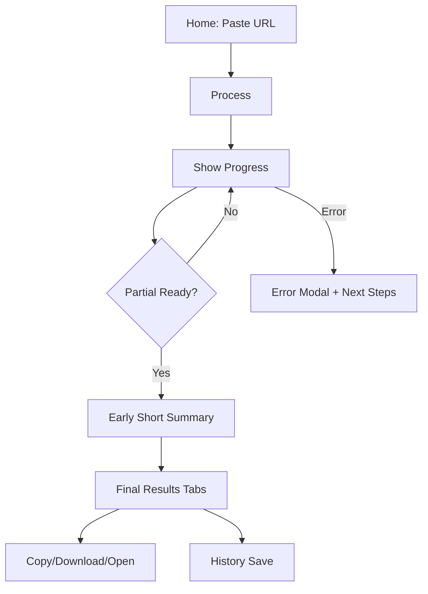

# MindTube — Frontend Design (MVP)

**File:** /docs/frontend-design.md  
**Version:** v0.1 (2025‑07‑26, JST)  
**Owner:** You (PM/Builder)

> Scope: Single‑user, web UI for ingesting a YouTube URL and presenting **Summary / Key Ideas / Takeaways / Transcript** with timestamp links and Markdown export. Optimized for **fast MVP** using Next.js (App Router) + TypeScript.

---

## 1) Goals & Non‑Goals

**Goals**
- Zero‑friction flow: paste URL → see progress → get results with timestamp links.
- Clear, accessible UI with keyboard support and screen‑reader friendly structure.
- Works well on desktop; responsive enough for small screens.

**Non‑Goals (MVP)**
- Account system, themes, multi‑project management.
- Full internationalization beyond EN/JA copy; advanced layouts or animations.

---

## 2) Information Architecture & Navigation

**Routes**
- `/` — Landing + Processing + Results in a single page experience.
- `/r/[jobId]` — (Optional) deep link to a specific run; loads cached artifacts if present.

**Primary regions**
1. **Header** — Brand, Settings, History.
2. **Hero/Input** — URL field + Process button (disabled until valid).
3. **Progress** — Stage list + early short summary (live updates).
4. **Results Tabs** — Summary / Key Ideas / Takeaways / Transcript (+ toolbar).
5. **Drawers/Modals** — History drawer, Settings modal, Error modal, Toast area.

**User Flow (Mermaid)**


---

## 3) Technology & Libraries

- **Next.js 14+ (App Router)** — file routing, edge‑ready if needed.
- **TypeScript** — strict mode.
- **UI**: Tailwind CSS + small utility components (or shadcn/ui if you prefer).  
- **Data fetching**: **TanStack Query (React Query)** for `/status` polling and `/result` fetch; retries/backoff.
- **State**: Local component state + `localStorage` for Settings & History.
- **Icons**: Lucide (optional).  
- **Testing**: Vitest + React Testing Library; Playwright/Cypress for smoke E2E.

_Why this stack?_ Minimal boilerplate, strong DX, and easy to evolve. React Query standardizes polling/caching logic cleanly.

---

## 4) Components (Inventory & Responsibilities)

| Component | Responsibility | Key Props / Types |
|---|---|---|
| `HeaderBar` | Brand, Settings, History buttons | `onOpenSettings()`, `onOpenHistory()` |
| `UrlForm` | Validate URL, trigger ingest | `onSubmit(url, params)`, validation state |
| `ProgressPanel` | Stage list + early short summary (live region) | `status`, `partialShort` |
| `ResultsToolbar` | Copy, Download `.md`, Open on YouTube | `sections`, `videoMeta`, `onCopy`, `onDownload`, `onOpenTs(ts)` |
| `ResultsTabs` | Tabs container with ARIA roles | `activeTab`, `onTabChange(tab)` |
| `SummaryPanel` | Short + Detailed + timestamp chips | `sections.short`, `sections.detailed`, `timestamps[]` |
| `IdeasPanel` | Key Ideas with timestamp links | `sections.ideas` |
| `TakeawaysPanel` | Ordered actionable takeaways | `sections.takeaways` |
| `TranscriptPanel` | Virtualized transcript + search | `segments`, `onSearch(q)` |
| `SettingsModal` | Language/duration/ASR/budget | `settings`, `onSave(settings)` |
| `HistoryDrawer` | Last 20 entries (local) | `entries`, `onOpen(entry)`, `onDelete(id)` |
| `ErrorModal` | Friendly error with actions | `error`, `onClose()`, `actions[]` |
| `Toast` | Short feedback (copied, saved) | `message` |

**Shared Utilities**
- `time.ts` — `toSeconds("mm:ss")`, `toStamp(seconds)`
- `markdown.ts` — build `.md` string from `sections + meta`
- `validators.ts` — YouTube URL patterns
- `yt.ts` — build YouTube `&t=Ss` link

---

## 5) Data Contracts (Frontend Types)

```ts
// types/api.ts
export type IngestRequest = { url: string; asr?: boolean; lang?: "auto"|"en"|"ja"; budget_yen?: number };
export type IngestResponse = { job_id: string };

export type Progress = {
  stage: "validating"|"captions"|"chunking"|"mapping"|"reducing"|"finalizing"|"done"|"error";
  pct: number; eta_seconds?: number; cached?: boolean;
};
export type StatusResponse = { status: "queued"|"running"|"done"|"error"|"canceled"; progress: Progress };

export type Sections = {
  short: string;
  detailed: string[];
  ideas: [string, string][];       // ["mm:ss","text"]
  takeaways: string[];
};
export type ResultResponse = {
  video: { title: string; channel: string; duration: number; url: string };
  sections: Sections;
  links: { markdown?: string; transcript_json?: string };
};
```

---

## 6) State Management & Data Flow

**React Query Keys**
- `["status", jobId]` — polls every 1500ms until `done|error` (backoff on error).
- `["result", jobId]` — fetched once ready; cached for session.
- `["settings"]` — localStorage persisted.
- `["history"]` — localStorage persisted.

**Local Storage Shapes**
```ts
type Settings = { lang: "auto"|"en"|"ja"; duration_limit: number; asr: "off"|"ask"|"on"; budget_yen: number };
type HistoryEntry = { when: string; title: string; duration: string; jobId?: string; url: string };
```

**Polling Strategy**
- Start polling on `jobId` set. If status `running` with `progress.partial_short`, update UI.
- On `done`, stop polling; prefetch `["result", jobId]`.

**Progress Announcements**
- Use `aria-live="polite"` region in `ProgressPanel` for screen reader updates.

---

## 7) UI/UX Details

**Validation**
- Disable Process until URL passes regex; show inline helper “Example: https://youtube.com/watch?v=abc123”.

**Tabs (ARIA)**
- `role="tablist"` container; each `tab` has `aria-controls="#tabpanel-id"` and `aria-selected`.
- Keyboard: Left/Right to switch tabs; Home/End to jump; Enter/Space activates.

**Timestamp Chips**
- Compact monospace stamps (`[02:15 ▶]`), open new tab `_blank` with `rel="noopener"`.

**Error Copy (examples)**
- Invalid URL → “Please paste a valid YouTube link. Example: …”
- Private video → “This video is private or members‑only. Try a public video.”
- No captions → “No transcript found. Enable Speech‑to‑Text (slower, may incur cost)?”

**Accessibility**
- Focus rings visible; min target 44px.
- Color contrast ≥ WCAG AA on dark theme.
- Live region for progress; `aria-busy` on results while loading.

**Responsive**
- Container width max 960px; stack columns under 640px; allow horizontal scrolling in transcript body if needed.

---

## 8) Styling & Design Tokens

Use Tailwind with CSS variables (dark by default).

```css
:root {
  --bg: #0b0e14;
  --panel: #0f1421;
  --text: #e6e9ef;
  --muted: #98a2b3;
  --accent: #6ea8fe;
  --ok: #22c55e;
  --warn: #f59e0b;
  --err: #ef4444;
  --border: #222a3b;
}
```

**Components**
- Panels: rounded `xl`, 1px border (`--border`), subtle radial gradient (optional).
- Buttons: primary (filled), secondary (outline/ghost), tertiary (icon).
- Typography: Title 20–24px semibold; body 14–16px; monospace for timestamps.

---

## 9) Example Code (Skeletons)

**App Page (`app/page.tsx`)**
```tsx
"use client";
import { useState } from "react";
import { useMutation, useQuery } from "@tanstack/react-query";
import { UrlForm } from "@/components/UrlForm";
import { ProgressPanel } from "@/components/ProgressPanel";
import { ResultsView } from "@/components/ResultsView";
import { ingest, getStatus, getResult } from "@/lib/api";

export default function Home() {
  const [jobId, setJobId] = useState<string | null>(null);

  const ingestMut = useMutation({
    mutationFn: ingest,
    onSuccess: (res) => setJobId(res.job_id),
  });

  const statusQ = useQuery({
    queryKey: ["status", jobId],
    queryFn: () => getStatus(jobId!),
    enabled: !!jobId,
    refetchInterval: (q) => (q.state.data?.status === "running" ? 1500 : false),
  });

  const resultQ = useQuery({
    queryKey: ["result", jobId],
    queryFn: () => getResult(jobId!),
    enabled: !!jobId && statusQ.data?.status === "done",
  });

  return (
    <main className="container mx-auto px-4 py-6">
      <UrlForm onSubmit={(payload) => ingestMut.mutate(payload)} loading={ingestMut.isPending} />
      {jobId && <ProgressPanel data={statusQ.data} />}
      {resultQ.data && <ResultsView result={resultQ.data} />}
    </main>
  );
}
```

**URL Form (validation)**
```tsx
export function UrlForm({ onSubmit, loading }: { onSubmit: (p:{url:string; asr?:boolean; lang?:string; budget_yen?:number})=>void; loading?: boolean }) {
  const [url, setUrl] = useState("");
  const valid = /^(https?:\/\/)?(www\.)?(youtube\.com|youtu\.be)\/.+$/i.test(url);
  return (
    <div className="card p-4">
      <div className="flex gap-2">
        <input value={url} onChange={(e)=>setUrl(e.target.value)} placeholder="Paste a YouTube URL" className="flex-1 input" />
        <button disabled={!valid || loading} onClick={()=>onSubmit({url, lang:"auto"})} className="btn btn-primary">Process</button>
      </div>
      {!valid && url && <p className="text-err text-sm mt-2">Example: https://youtube.com/watch?v=abc123</p>}
    </div>
  );
}
```

**Results Tabs (ARIA skeleton)**
```tsx
export function ResultsTabs({active, onChange}:{active:string; onChange:(t:string)=>void}){
  const tabs = ["summary","ideas","takeaways","transcript"];
  return (
    <div>
      <div role="tablist" aria-label="Results Tabs" className="flex gap-2 border-b border-border">
        {tabs.map(t => (
          <button key={t} role="tab" aria-selected={active===t} aria-controls={`pane-${t}`}
            className={`tab ${active===t ? "tab-active" : ""}`}
            onClick={()=>onChange(t)}>{t[0].toUpperCase()+t.slice(1)}</button>
        ))}
      </div>
      {/* panes rendered by parent */}
    </div>
  );
}
```

---

## 10) Error Handling Patterns

**Mapping** backend codes to UX:
- `INVALID_URL` → inline error on form.
- `VIDEO_PRIVATE` | `DELETED` → modal with guidance.
- `NO_CAPTIONS` → ASR prompt modal (“Enable & Continue” | Cancel).
- `DURATION_LIMIT` → modal with limit value and settings link.
- `QUEUE_FULL` → queued notice + ETA + cancel button.

**Fallbacks**
- If `/status` fails transiently → show “Reconnecting…”; retry with backoff (0.5s → 2s → 5s).

---

## 11) Performance Considerations

- **Transcript panel**: Use virtualization for long lists (e.g., `react-virtuoso`) post‑MVP.
- **Polling window**: Stop polling once `done|error` to save CPU/network.
- **Bundle**: Lazy‑load History/Settings modals; code‑split transcript panel.

---

## 12) Testing Strategy (FE)

- **Unit**: validators, markdown exporter, time utils, tabs keyboard behavior.
- **Component**: UrlForm validation states; ProgressPanel live region; ResultsView renders.
- **E2E**: end‑to‑end happy path with mocked API (MSW/Playwright).
- **Accessibility**: Lighthouse + jest‑axe on key screens.

---

## 13) Analytics & Telemetry (Optional)

- Client timing marks: time from click “Process” to 1) first partial summary, 2) results render.
- Button click counts: Copy, Download, Open on YouTube.
- Error surfaces frequency (to guide polish).

---

## 14) Acceptance Criteria (FE)

- URL validation prevents submissions; inline helper appears within 200ms.
- Progress shows stage transitions; early short summary appears when sent.
- Tabs are keyboard navigable and screen‑reader friendly.
- Timestamp chips open the correct YouTube position (±5s).
- Markdown export mirrors the on‑screen sections.
- History drawer opens cached results without recompute.

---

## 15) Open Questions

- Keep everything on one page, or prefer `/r/[jobId]` deep link for sharing?
- Use SSE for progress instead of polling? (depends on backend support)
- Include optimistic “short summary” placeholder animation?

---

## 16) Build & Deploy Notes

- `NEXT_PUBLIC_API_BASE` env for API origin.
- Static assets only; no image optimization needed in MVP.
- CSP: allow only the API origin and youtube.com for links.

---

## 17) Checklist (Front‑end Delivery)

- [ ] URL form with robust validation and helpful errors
- [ ] Status polling with backoff; aria‑live progress
- [ ] Tabs + panels with ARIA roles and keyboard support
- [ ] Timestamp chips and open‑in‑YouTube actions
- [ ] Markdown copy & download parity
- [ ] History drawer and Settings modal
- [ ] Basic tests (unit/component), Lighthouse a11y pass
