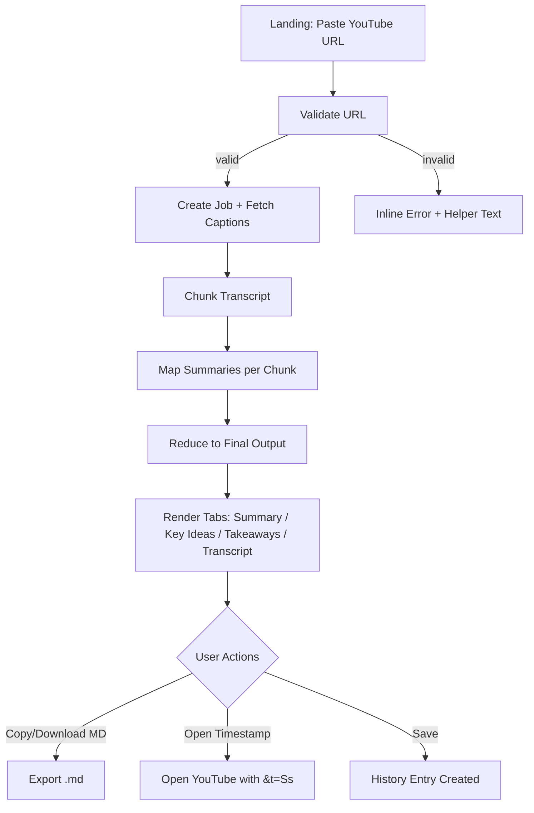
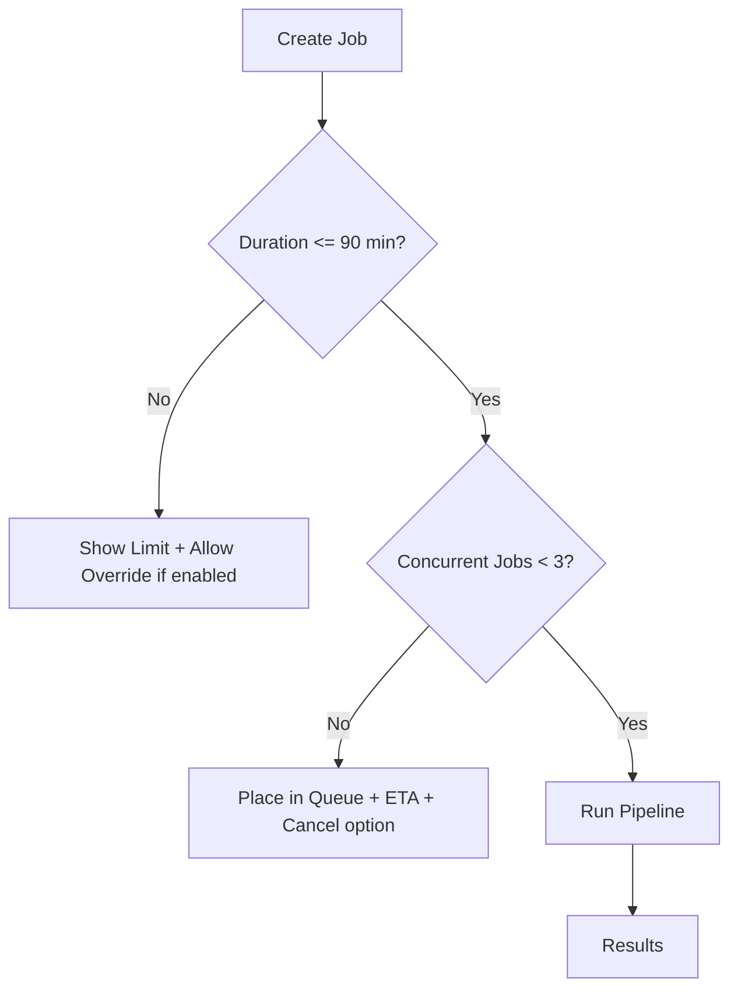
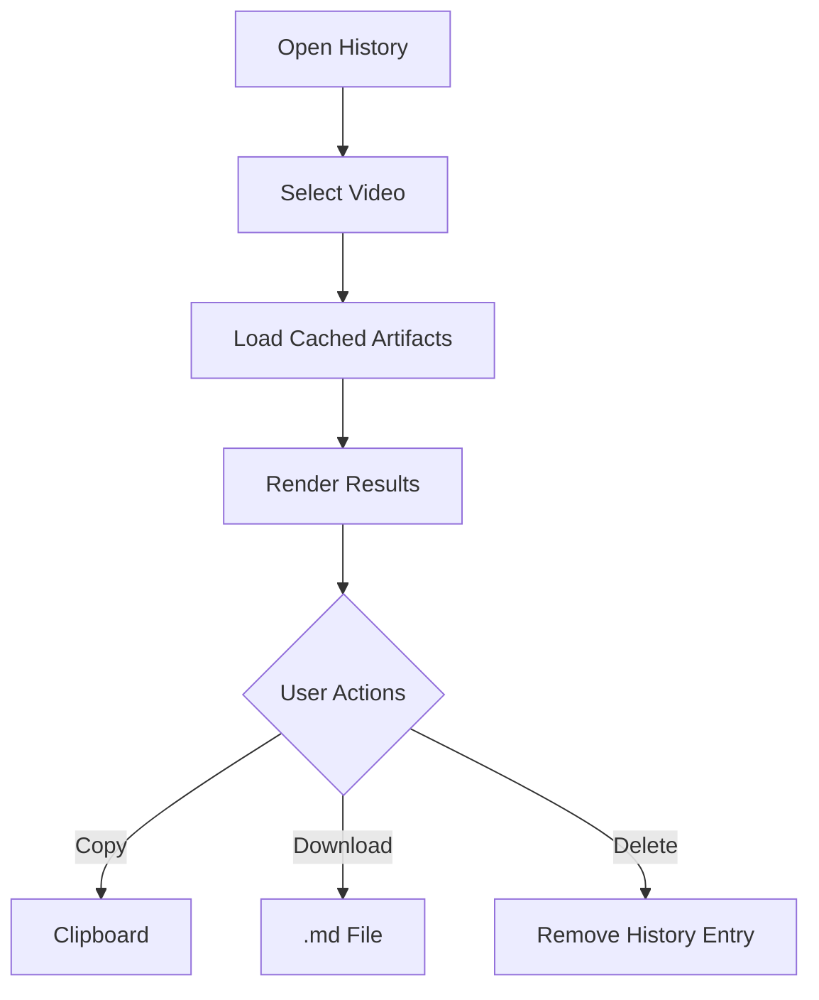

# MindTube MVP — Low‑Fidelity UX Package

## 1. User Flows

### 1A. Happy Path — Summarize a Video (captions available)



### 1B. No Transcript → Offer ASR Fallback

```mermaid
flowchart TD
  A[Landing: Paste URL] --> B[Validate]
  B --> C[Try Captions]
  C -->|none| D[Prompt: "No transcript found" + Enable ASR?]
  D -->|Enable| E[ASR Worker (Whisper) + Progress]
  E --> F[Summarize Pipeline]
  F --> G[Results Tabs]
  D -->|Cancel| H[Return to Landing]
```

### 1C. Duration/Rate Limits (Queueing)



### 1D. Reopen Past Result & Export



---

## 2. Wireframes (ASCII, Low‑Fi)

> Focus is on structure, not visuals. Each `[]` is a clickable control, `()` toggles, `{}` fields.

### 2A. Landing / URL Input

```
+---------------------------------------------------------------------------------+
| MindTube                                                   [?] Settings [History]|
+---------------------------------------------------------------------------------+
| Paste a YouTube URL                                                             |
| { https://www.youtube.com/watch?v=XXXXXXXX }                [ Process ]         |
|                                                                                 |
| Tips: Works best with videos <= 90 min. English/Japanese supported.             |
| Errors appear inline below the field.                                           |
+---------------------------------------------------------------------------------+
| Footer: v1.2 • Privacy: Local-only by default                                   |
+---------------------------------------------------------------------------------+
Inline error (invalid URL)
```

**Inline error example:**
```
! Please enter a valid YouTube URL. Example: https://youtube.com/watch?v=abc123
```

### 2B. Processing / Progress

```
+---------------------------------------------------------------------------------+
| MindTube                                                   [Cancel Job]         |
+---------------------------------------------------------------------------------+
| Video: How to Learn Faster — Spaced Repetition (12:34)                          |
|                                                                                 |
| Progress                                                                        |
| [✓] Validating URL                                                              |
| [✓] Fetching captions                                                           |
| [~] Chunking transcript                                                          |
| [ ] Summarizing (chunk 3/8)                                                     |
|                                                                                 |
| Early Output                                                                    |
| Short Summary (partial):                                                        |
| - The talk introduces spaced repetition... (updating...)                        |
+---------------------------------------------------------------------------------+
```

### 2C. Results (Tabs)

```
+---------------------------------------------------------------------------------+
| MindTube                             [Copy] [Download .md] [Open on YouTube]    |
| Title: How to Learn Faster — Spaced Repetition      [History] [Settings]        |
+---------------------------------------------------------------------------------+
| [ Summary ] [ Key Ideas ] [ Takeaways ] [ Transcript ]                          |
+---------------------------------------------------------------------------------+
| SUMMARY                                                                         |
| • Spaced repetition improves long-term retention by...                          |
| • ...                                                                           |
|                                                                                 |
| Timestamped Highlights                                                          |
| • 02:15 — "Memory decay..." [Open ▶]                                            |
| • 07:42 — "Intervals should..." [Open ▶]                                        |
+---------------------------------------------------------------------------------+
```

**Key Ideas tab:**
```
[ Key Ideas ]
- (00:45) Core premise: review over increasing intervals [▶]
- (02:15) Forgetting curve + practical intervals [▶]
- ...
```

**Transcript tab:**
```
[ Transcript ]
(00:00) Welcome to...
(00:12) Today we'll cover...
...
[Find in transcript: { query }  (Search)]
```

### 2D. No Transcript State (Offer ASR)

```
+---------------------------------------------------------------------------------+
| No transcript was found for this video.                                         |
|                                                                                 |
| ( ) Enable Speech-to-Text (ASR) for this run (slower, may incur cost)           |
|      Est. time: 2–5 min for 20–40 min video.                                   |
| [ Enable & Continue ]   [ Cancel ]                                              |
+---------------------------------------------------------------------------------+
```

### 2E. Settings (Modal)

```
+-------------------------------- Settings ---------------------------------------+
| Language priority: (•) Auto  ( ) English  ( ) Japanese                          |
| Video duration limit (min): [ 90 ]                                             |
| Concurrency limit: [ 3 ]                                                       |
| ASR fallback default: ( ) Off  (•) Ask each time  ( ) On                        |
| Privacy: (•) Local-only  ( ) Save results to disk                               |
| Token/cost guardrail per run (¥): [ 25 ]                                       |
| [ Save ] [ Cancel ]                                                             |
+---------------------------------------------------------------------------------+
```

### 2F. History (Drawer/List)

```
+------------------------------ History ------------------------------------------+
| [ ] Keep local history (last 20)                                                |
| --------------------------------------------------------------------------------|
| 07/26 23:05  How to Learn Faster — Spaced... (12:34)   [Open] [Delete]         |
| 07/26 20:11  LLM Lecture: Prompt Compression (48:19)   [Open] [Delete]         |
| 07/25 09:02  Interview: Deep Learning... (1:01:02)     [Open] [Delete]         |
+---------------------------------------------------------------------------------+
```

---

## 3. Mockups (Optional, Slightly Higher‑Fi Guidance)

**Layout**
- Container: max‑width 960px; 16–20px base spacing; 24–32px section spacing.
- Header: Left brand, right actions (Settings, History). Sticky on scroll.
- Tabs: Underlined active tab; keyboard navigable.
- Cards: Use subtle elevation for sections (results blocks).
- Buttons: Primary = “Process”, Secondary = “Download .md”, Tertiary = “Open on YouTube”.

**Typography**
- Title 20–24px/semibold; body 14–16px/regular; monospace for timestamps.

**Interaction**
- Show optimistic partial output during processing (short summary first).
- Timestamp chips are clickable (`[02:15 ▶]`).
- Errors appear inline, with action links (e.g., “Enable ASR”).

**Accessibility**
- Form labels, aria‑labels on buttons, focus rings, 44px min hit targets.
- High contrast for status states (Success/Progress/Error icons + text).

**Copy (microcopy)**
- URL helper: “Example: https://youtube.com/watch?v=abc123”
- Processing tip: “You can navigate away; results stay in History.”

---

## 4. Screen‑Level Acceptance Criteria (MVP)

**Landing**
- URL validation handles common formats; invalid shows helper within 200ms.
- “Process” disabled until valid.

**Processing**
- Progress list updates at least every 2s; cancel returns to Landing.
- Partial “Short Summary” appears within 15s for ≤10‑min video with captions.

**Results**
- Tabs render in <500ms after data load.
- Each timestamp opens the correct video position (±5s).
- Markdown export exactly mirrors on‑screen sections.

**No Transcript**
- ASR prompt only appears when captions unavailable.
- Estimated time updates after ASR start (based on length).

**History**
- Opening a past item reuses cached artifacts (no re‑summarize call).