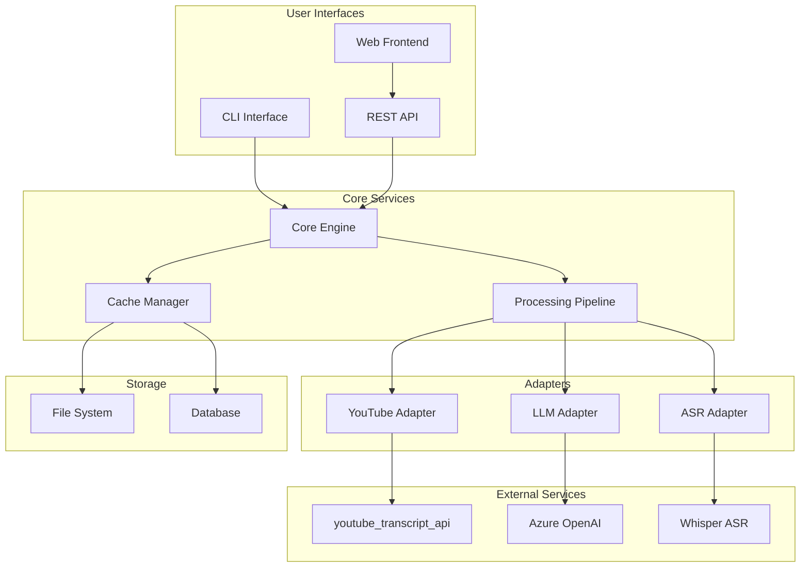

# MindTube - Design Document

## Table of Contents
1. [Overview](#overview)
2. [System Architecture](#system-architecture)
3. [Core Components](#core-components)
4. [Data Models](#data-models)
5. [API Design](#api-design)
6. [CLI Interface](#cli-interface)
7. [Processing Pipeline](#processing-pipeline)
8. [Storage Strategy](#storage-strategy)
9. [Error Handling](#error-handling)
10. [Performance Considerations](#performance-considerations)
11. [Security](#security)
12. [Testing Strategy](#testing-strategy)
13. [Deployment](#deployment)

## Overview

MindTube is a YouTube learning assistant that extracts structured knowledge from YouTube videos through transcripts, summaries, key ideas, and visual mindmaps. The system is designed as a modular, extensible platform supporting both CLI and API interfaces.

### Key Features
- **Transcript Extraction**: Automated retrieval of video transcripts
- **Content Summarization**: AI-powered summarization of video content
- **Key Ideas Extraction**: Identification of main concepts and takeaways
- **Mindmap Generation**: Visual representation in Mermaid format
- **Multiple Output Formats**: JSON, Markdown, HTML support
- **Caching System**: Efficient storage and retrieval of processed content

### Design Principles
- **Modularity**: Loosely coupled components with clear interfaces
- **Extensibility**: Plugin-based architecture for new features
- **Performance**: Efficient processing with caching and async operations
- **Reliability**: Robust error handling and graceful degradation
- **Testability**: Comprehensive test coverage with isolated components

## System Architecture



## Core Components

### 1. Core Engine (`mindtube/core/`)

**Purpose**: Central orchestration of all processing operations.

**Key Classes**:
```python
class MindTubeEngine:
    """Main engine coordinating all operations"""
    
    def __init__(self, config: Config):
        self.transcript_service = TranscriptService()
        self.llm_service = LLMService()
        self.cache_service = CacheService()
    
    async def process_video(self, url: str, options: ProcessingOptions) -> VideoAnalysis
    async def get_transcript(self, url: str) -> Transcript
    async def generate_summary(self, transcript: Transcript) -> Summary
    async def extract_key_ideas(self, transcript: Transcript) -> List[KeyIdea]
    async def generate_mindmap(self, analysis: VideoAnalysis) -> Mindmap
```

### 2. Processing Pipeline (`mindtube/pipeline/`)

**Purpose**: Manages the sequential processing of video content through various stages.

**Pipeline Stages**:
1. **Input Validation**: URL validation and metadata extraction
2. **Transcript Acquisition**: Fetch or generate transcripts
3. **Content Analysis**: LLM-based analysis and summarization
4. **Output Generation**: Format results according to user preferences
5. **Caching**: Store results for future retrieval

```python
class ProcessingPipeline:
    """Manages the processing workflow"""
    
    def __init__(self):
        self.stages = [
            InputValidationStage(),
            TranscriptStage(),
            AnalysisStage(),
            OutputStage(),
            CacheStage()
        ]
    
    async def execute(self, request: ProcessingRequest) -> ProcessingResult
```

### 3. Adapter Layer (`mindtube/adapters/`)

**Purpose**: Abstraction layer for external services with consistent interfaces.

**Adapters**:
- **YouTube Adapter**: Uses `youtube_transcript_api` for transcript extraction
- **LLM Adapter**: Manages Azure OpenAI API interactions
- **ASR Adapter**: Audio-to-text conversion when transcripts unavailable (Whisper)
- **Storage Adapter**: File system and database operations

#### YouTube Transcript Adapter (`adapters/youtube.py`)
```python
from youtube_transcript_api import YouTubeTranscriptApi
from youtube_transcript_api.formatters import TextFormatter

class YouTubeAdapter:
    def __init__(self):
        self.formatter = TextFormatter()
    
    async def get_transcript(self, video_id: str, languages: List[str] = ['en']) -> Transcript:
        """Extract transcript using youtube_transcript_api"""
        try:
            # Get available transcripts
            transcript_list = YouTubeTranscriptApi.list_transcripts(video_id)
            
            # Try to find manual transcript first
            for lang in languages:
                try:
                    transcript = transcript_list.find_manually_created_transcript([lang])
                    return self._format_transcript(transcript.fetch(), 'manual', lang)
                except:
                    continue
            
            # Fallback to auto-generated
            for lang in languages:
                try:
                    transcript = transcript_list.find_generated_transcript([lang])
                    return self._format_transcript(transcript.fetch(), 'auto', lang)
                except:
                    continue
                    
            raise TranscriptNotAvailableError(f"No transcript available for {video_id}")
            
        except Exception as e:
            raise TranscriptExtractionError(f"Failed to extract transcript: {str(e)}")
```

#### Azure OpenAI Adapter (`adapters/azure_openai.py`)
```python
from openai import AzureOpenAI

class AzureOpenAIAdapter:
    def __init__(self, config: AzureConfig):
        self.client = AzureOpenAI(
            api_key=config.api_key,
            api_version=config.api_version,
            azure_endpoint=config.endpoint
        )
        self.deployment_name = config.deployment_name
    
    async def generate_summary(self, transcript: str, max_tokens: int = 500) -> str:
        """Generate summary using Azure OpenAI"""
        prompt = self._build_summary_prompt(transcript)
        
        response = await self.client.chat.completions.create(
            model=self.deployment_name,
            messages=[
                {"role": "system", "content": "You are a helpful assistant that creates concise summaries."},
                {"role": "user", "content": prompt}
            ],
            max_tokens=max_tokens,
            temperature=0.3
        )
        
        return response.choices[0].message.content
    
    async def extract_key_ideas(self, transcript: str) -> List[str]:
        """Extract key ideas using Azure OpenAI"""
        prompt = self._build_key_ideas_prompt(transcript)
        
        response = await self.client.chat.completions.create(
            model=self.deployment_name,
            messages=[
                {"role": "system", "content": "You are an expert at identifying key concepts and ideas."},
                {"role": "user", "content": prompt}
            ],
            max_tokens=800,
            temperature=0.2
        )
        
        return self._parse_key_ideas(response.choices[0].message.content)
```

### 4. Cache Manager (`mindtube/cache/`)

**Purpose**: Intelligent caching system for processed content and API responses.

**Features**:
- **Multi-level Caching**: Memory, file system, and database layers
- **TTL Management**: Configurable expiration policies
- **Cache Invalidation**: Smart invalidation based on content changes
- **Compression**: Efficient storage of large transcript data

## Data Models

### Core Models (`mindtube/models/`)

```python
@dataclass
class VideoMetadata:
    """YouTube video metadata"""
    video_id: str
    title: str
    description: str
    duration: int
    upload_date: datetime
    channel: str
    view_count: int
    language: Optional[str] = None

@dataclass
class Transcript:
    """Video transcript with timing information"""
    video_id: str
    segments: List[TranscriptSegment]
    language: str
    source: TranscriptSource  # youtube_auto, youtube_manual, asr
    confidence: Optional[float] = None

@dataclass
class TranscriptSegment:
    """Individual transcript segment"""
    text: str
    start_time: float
    duration: float
    confidence: Optional[float] = None

@dataclass
class Summary:
    """Generated summary of video content"""
    video_id: str
    content: str
    key_points: List[str]
    word_count: int
    generated_at: datetime
    model_used: str

@dataclass
class KeyIdea:
    """Extracted key idea or concept"""
    title: str
    description: str
    timestamp: Optional[float] = None
    importance_score: float = 0.0
    category: Optional[str] = None

@dataclass
class Mindmap:
    """Mermaid mindmap representation"""
    video_id: str
    mermaid_code: str
    nodes: List[MindmapNode]
    generated_at: datetime

@dataclass
class VideoAnalysis:
    """Complete analysis result"""
    metadata: VideoMetadata
    transcript: Transcript
    summary: Summary
    key_ideas: List[KeyIdea]
    mindmap: Optional[Mindmap] = None
    processing_time: float = 0.0
```

## API Design

### REST API Endpoints (`mindtube/api/`)

**Base URL**: `/api/v1`

#### Video Analysis
```
POST /analyze
Content-Type: application/json

{
    "url": "https://youtu.be/VIDEO_ID",
    "options": {
        "include_summary": true,
        "include_key_ideas": true,
        "include_mindmap": true,
        "output_format": "json",
        "llm_model": "gpt-35-turbo"
    }
}

Response: VideoAnalysis
```

#### Transcript Only
```
GET /transcript?url=https://youtu.be/VIDEO_ID
Response: Transcript
```

#### Summary Only
```
POST /summarize
{
    "url": "https://youtu.be/VIDEO_ID",
    "max_length": 500
}
Response: Summary
```

#### Mindmap Generation
```
POST /mindmap
{
    "url": "https://youtu.be/VIDEO_ID",
    "style": "hierarchical"
}
Response: Mindmap
```

#### Health Check
```
GET /health
Response: {"status": "healthy", "version": "1.0.0"}
```

### WebSocket Support
```
WS /ws/analyze
- Real-time progress updates during processing
- Streaming results as they become available
```

## CLI Interface

### Command Structure (`mindtube/cli/`)

```bash
# Main commands
mindtube analyze <url> [options]
mindtube summarize <url> [options]
mindtube transcript <url> [options]
mindtube mindmap <url> [options]

# Global options
--output-format {json,markdown,html}
--save [filename]
--cache-dir <path>
--llm-model <azure-model>
--verbose
--quiet

# Examples
mindtube analyze https://youtu.be/ID --save analysis.json
mindtube summarize https://youtu.be/ID --max-length 300
mindtube mindmap https://youtu.be/ID --style hierarchical --save mindmap.md
```

### Configuration
```yaml
# ~/.mindtube/config.yaml
llm:
  provider: azure_openai
  endpoint: ${AZURE_OPENAI_ENDPOINT}
  api_key: ${AZURE_OPENAI_API_KEY}
  api_version: "2024-02-15-preview"
  deployment_name: "gpt-35-turbo"

cache:
  enabled: true
  directory: ~/.mindtube/cache
  max_size: 1GB
  ttl: 7d

output:
  default_format: json
  save_directory: ./mindtube_output
```

## Processing Pipeline

### Stage-by-Stage Flow

#### 1. Input Validation Stage
```python
class InputValidationStage:
    async def process(self, request: ProcessingRequest) -> ValidationResult:
        # Validate YouTube URL format
        # Extract video ID
        # Check video accessibility
        # Gather basic metadata
```

#### 2. Transcript Acquisition Stage
```python
class TranscriptStage:
    async def process(self, request: ProcessingRequest) -> TranscriptResult:
        # Check cache for existing transcript
        # Use youtube_transcript_api to get available transcripts
        # Try manual captions first, then auto-generated
        # Handle multiple languages if available
        # Fallback to ASR if no transcripts found
        # Store in cache
```

#### 3. Analysis Stage
```python
class AnalysisStage:
    async def process(self, request: ProcessingRequest) -> AnalysisResult:
        # Generate summary using LLM
        # Extract key ideas
        # Create mindmap structure
        # Apply post-processing filters
```

#### 4. Output Formatting Stage
```python
class OutputStage:
    async def process(self, request: ProcessingRequest) -> OutputResult:
        # Format according to user preferences
        # Apply templates
        # Generate final output
```

## Storage Strategy

### File System Structure
```
~/.mindtube/
├── cache/
│   ├── transcripts/
│   │   └── {video_id}.json
│   ├── summaries/
│   │   └── {video_id}_{model}.json
│   └── metadata/
│       └── {video_id}.json
├── config.yaml
└── logs/
    └── mindtube.log
```

### Database Schema (Optional)
```sql
-- For advanced caching and analytics
CREATE TABLE videos (
    id TEXT PRIMARY KEY,
    title TEXT,
    channel TEXT,
    duration INTEGER,
    upload_date TIMESTAMP,
    last_processed TIMESTAMP
);

CREATE TABLE transcripts (
    video_id TEXT REFERENCES videos(id),
    source TEXT,
    language TEXT,
    content TEXT,
    created_at TIMESTAMP
);

CREATE TABLE analyses (
    id UUID PRIMARY KEY,
    video_id TEXT REFERENCES videos(id),
    type TEXT, -- summary, key_ideas, mindmap
    content TEXT,
    model_used TEXT,
    created_at TIMESTAMP
);
```

## Error Handling

### Error Categories
1. **Input Errors**: Invalid URLs, inaccessible videos
2. **Service Errors**: API failures, network issues
3. **Processing Errors**: LLM failures, parsing errors
4. **Storage Errors**: Cache failures, disk space issues

### Error Response Format
```python
@dataclass
class ErrorResponse:
    error_code: str
    message: str
    details: Optional[Dict] = None
    retry_after: Optional[int] = None
    
# Example errors
VIDEO_NOT_FOUND = "VIDEO_NOT_FOUND"
TRANSCRIPT_UNAVAILABLE = "TRANSCRIPT_UNAVAILABLE"
LLM_SERVICE_ERROR = "LLM_SERVICE_ERROR"
RATE_LIMIT_EXCEEDED = "RATE_LIMIT_EXCEEDED"
```

### Graceful Degradation
- Fallback to cached results when services fail
- Partial results when some components fail
- Alternative transcript sources
- Retry mechanisms with exponential backoff

## Performance Considerations

### Optimization Strategies
1. **Async Processing**: Non-blocking I/O operations
2. **Parallel Processing**: Concurrent analysis tasks
3. **Intelligent Caching**: Multi-level cache hierarchy
4. **Batch Processing**: Group similar requests
5. **Resource Pooling**: Connection and thread pools

### Performance Targets
- **Transcript Extraction**: < 5 seconds
- **Summary Generation**: < 30 seconds
- **Complete Analysis**: < 60 seconds
- **Cache Hit Response**: < 1 second
- **API Response Time**: 95th percentile < 2 seconds

## Security

### Security Measures
1. **API Key Management**: Secure storage and rotation of Azure OpenAI credentials
2. **Input Validation**: Sanitize all user inputs
3. **Rate Limiting**: Prevent abuse and DoS attacks
4. **HTTPS Only**: Encrypted communication
5. **CORS Configuration**: Proper cross-origin policies

### Privacy Considerations
- No storage of personal information
- Optional data retention policies
- User consent for caching
- Anonymized analytics

## Testing Strategy

### Test Categories
1. **Unit Tests**: Individual component testing
2. **Integration Tests**: Service interaction testing
3. **End-to-End Tests**: Complete workflow testing
4. **Performance Tests**: Load and stress testing
5. **Security Tests**: Vulnerability assessment

### Test Structure
```
tests/
├── unit/
│   ├── test_core.py
│   ├── test_adapters.py
│   └── test_models.py
├── integration/
│   ├── test_pipeline.py
│   └── test_api.py
├── e2e/
│   └── test_workflows.py
├── performance/
│   └── test_load.py
└── fixtures/
    ├── sample_transcripts.json
    └── mock_responses.json
```

### Test Data Management
- Mock YouTube API responses
- Sample transcript fixtures
- Deterministic LLM responses for testing
- Isolated test environments

## Deployment

### Deployment Options
1. **Local Installation**: pip/uv package installation
2. **Docker Container**: Containerized deployment
3. **Cloud Functions**: Serverless deployment
4. **Kubernetes**: Scalable container orchestration

### Docker Configuration
```dockerfile
FROM python:3.11-slim

WORKDIR /app
COPY requirements.txt .
RUN pip install -r requirements.txt

COPY . .
EXPOSE 8000

CMD ["uvicorn", "mindtube.api.app:create_app", "--host", "0.0.0.0", "--port", "8000"]
```

### Environment Configuration
```bash
# Required
AZURE_OPENAI_ENDPOINT=https://your-resource.openai.azure.com/
AZURE_OPENAI_API_KEY=your-api-key

# Optional
MINDTUBE_CACHE_DIR=/app/cache
MINDTUBE_LOG_LEVEL=INFO
MINDTUBE_MAX_WORKERS=4
```

### Monitoring and Observability
- Structured logging with correlation IDs
- Metrics collection (processing time, success rates)
- Health checks and readiness probes
- Error tracking and alerting

---

This design document serves as the technical blueprint for implementing MindTube. It should be updated as the system evolves and new requirements emerge.