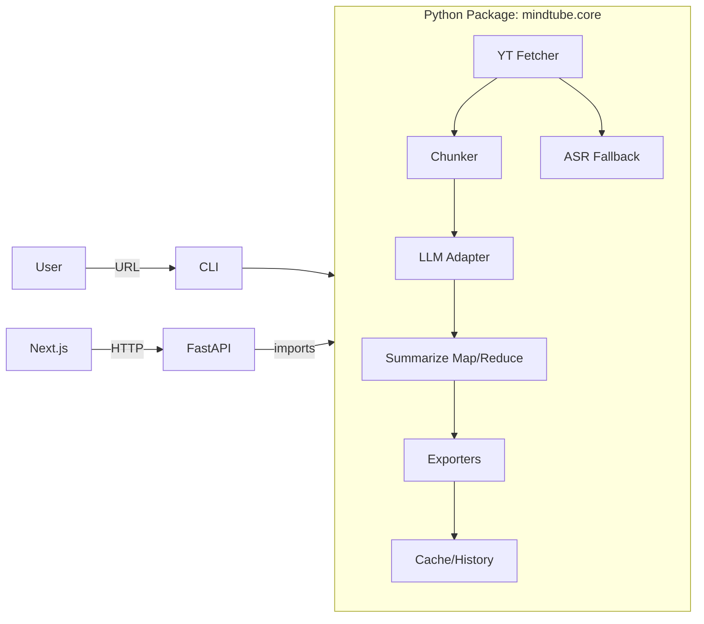

# MindTube — Design Document
**Version:** 2025-07-27

## Goals & NFRs
- Personal tool, fast, reproducible artifacts.
- Maintainable: typed, tested, modular.
- Cost ≤ $10/mo; CPU-only ok.

## High-Level Architecture

**Key idea:** single core reused by CLI and API.

## Repository Structure
```
mindtube/
  apps/
    cli/
      mindtube_cli/
        __init__.py
        main.py
      pyproject.toml
    api/
      app/
        __init__.py
        main.py
        routes.py
        models.py
        runners.py
        auth.py
        settings.py
        static/
      pyproject.toml
      Dockerfile
    web/
      package.json
      app/
        page.tsx
        runs/[id]/page.tsx
        components/
        lib/api.ts
  packages/
    core/
      mindtube/
        __init__.py
        config.py
        yt.py
        asr.py
        chunk.py
        llm/
          __init__.py
          base.py
          azure.py
          openai.py
          local.py
        pipeline.py
        prompts.py
        export.py
        cache.py
        utils.py
      tests/
        unit/
        e2e/
      pyproject.toml
  infra/
    docker-compose.yml
    scripts/
      install_ffmpeg.sh
      dev.sh
  .env.example
  README.md
```

## Key Components
- **yt.py**: URL → video_id; captions via `youtube-transcript-api`; normalize to JSONL.
- **asr.py**: `yt-dlp` audio; `faster-whisper` segments; timestamps kept.
- **chunk.py**: token-aware segmentation; preserves time ranges.
- **llm/**: provider interface (`generate`, `summarize_chunk`, `reduce_partials`, `mindmap_from_outline`); Azure first.
- **pipeline.py**: orchestration; returns artifact paths & run meta.
- **export.py**: writes `summary.json`, `notes.md`, `mindmap.mmd`, `transcript.jsonl`.
- **cache.py**: SQLite (runs, artifacts, costs) keyed by (video_id, transcript_hash, model, prompt_version).
- **API**: `/runs`, `/runs/{id}`, `/runs/{id}/artifacts`; background runner; static serving; API key.
- **FE**: URL form; status polling; tabs; Mermaid/Markdown rendering.

## Data Schemas
- Transcript line: `{start: float, end: float, text: str}`
- Map JSON: `{bullets[], ideas[], quotes[], tags[]}`
- Reduced JSON: `{tldr[], key_ideas[], takeaways[], outline[]}`

## Prompts (MVP)
- System: expert note-taker; concise; timestamps; “insufficient evidence” if unsure.
- Map: 2–4 bullets; 2–3 key ideas; optional quote; JSON only.
- Reduce: merge maps into TL;DR, key ideas, takeaways, outline; JSON only.
- Mindmap: convert outline+ideas to Mermaid `mindmap`, depth ≤3.

## User Flows
- **CLI**: URL → transcript/ASR → chunk → map/reduce → export → cache.
- **API**: POST run → background process → poll → artifacts.
- **FE**: paste URL → watch status → view tabs.

## Config (.env)
- `MINDTUBE_PROVIDER=azure`
- `AZURE_OPENAI_ENDPOINT`, `AZURE_OPENAI_API_KEY`, `AZURE_OPENAI_DEPLOYMENT`
- `LANG_PREF=en,ja`
- `DATA_DIR=/data/runs`

## Error Handling & Observability
- Typed errors; friendly messages.
- Structured logs; timings per stage; token costs.
- Progress % by stage.

## Testing Strategy (see TDD doc)
