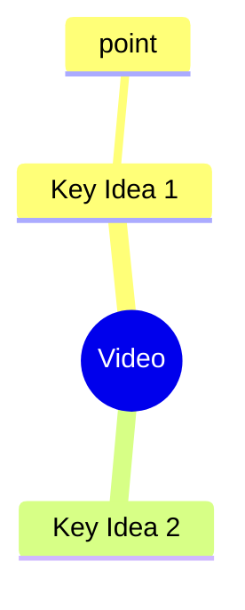

# MindTube - YouTube Learning Assistant

A CLI tool and API for extracting transcripts, summaries, key ideas, and mindmaps from YouTube videos.

## Project Overview

MindTube helps busy learners extract structured knowledge from YouTube videos by providing:
- Concise summaries
- Key ideas extraction
- Actionable takeaways
- Visual mindmaps (Mermaid format)

## Development Phases

### Phase 0: Skeleton & Tooling (1-2 hours)

**Goal:** Green "hello world" test, CI basics, and a scalable layout.

#### Setup Commands

```bash
# Bootstrap project
make init
make install-deps  # includes youtube-transcript-api, openai (Azure), typer, pydantic
make install-dev-deps  # includes pytest, ruff, mypy

# Test & lint scripts (add to README)
make test
make lint
make typecheck
```

#### Repository Structure

```
mindtube/
├── pyproject.toml
├── README.md
├── src/mindtube/
│   ├── __init__.py
│   ├── cli.py
│   ├── core/        # Pure logic (TDD target)
│   └── adapters/    # I/O: YT, LLM, ASR
└── tests/
```

#### First Test (Red → Green)

```python
# tests/test_cli_smoke.py
from typer.testing import CliRunner
from mindtube.cli import app

def test_cli_hello():
    r = CliRunner().invoke(app, ["--version"])
    assert r.exit_code == 0
```

### Phase 1: MVP CLI - Transcript → Summaries (1-2 days)

**User Story:** "Given a YouTube URL, I get a transcript (if available) and a short summary text on stdout."

**Deferrals:**
- No audio download or ASR yet
- No API, no DB, no frontend
- One summary style only ("concise")

#### 1.1 Core Domain Types (Test-First)

```python
# tests/test_domain_models.py
from mindtube.core.models import VideoRequest

def test_video_request_validates():
    r = VideoRequest(url="https://www.youtube.com/watch?v=dQw4w9WgXcQ")
    assert r.video_id == "dQw4w9WgXcQ"
```

#### 1.2 Transcript Fetcher

```python
# tests/test_transcript_service.py
from mindtube.core.transcripts import get_transcript

def test_get_transcript_returns_text(monkeypatch):
    # monkeypatch youtube_transcript_api to return a known transcript
    text = get_transcript("dQw4w9WgXcQ")
    assert isinstance(text, str)
    assert len(text) > 20
```

#### 1.3 Summarizer (Rule-Based Initially)

```python
# tests/test_summarizer_rule_based.py
from mindtube.core.summarize import summarize_concise

def test_summarize_concise_min_length():
    s = summarize_concise("a long transcript ...")
    assert 80 <= len(s) <= 800
```

#### 1.4 CLI Command

```python
# tests/test_cli_summarize.py
from typer.testing import CliRunner
from mindtube.cli import app

def test_cli_summarize_basic():
    r = CliRunner().invoke(app, ["summarize", "https://youtu.be/ID"])
    assert r.exit_code == 0
    assert "Summary:" in r.stdout
```

**CLI Usage:**
```bash
mindtube summarize <youtube_url>
  --max-chars 2000
  --format text|md
```

**Definition of Done:**
- ✅ Valid URL with transcript → prints concise summary
- ✅ 90%+ unit test coverage
- ✅ README with quickstart

### Phase 2: Key Ideas, Takeaways, Notes, Mindmap (2-4 days)

**User Story:** "From the same URL, give me: summary, key ideas, takeaways, and a mindmap artifact (Markdown)."

#### 2.1 LLM Adapter

```python
# tests/test_llm_port.py
from mindtube.core.llm import LLM, Prompt, LLMResult

def test_llm_contract():
    class Dummy(LLM):
        def run(self, prompt: Prompt) -> LLMResult:
            return LLMResult(text="ok")
    assert Dummy().run(Prompt(system="s", user="u")).text == "ok"
```

**Configuration:** `--llm off|azure` (default: off, uses Azure OpenAI when enabled)

#### 2.2 Structured Output

```python
# tests/test_structured_output.py
from mindtube.core.outputs import compose_markdown

def test_markdown_sections_present():
    md = compose_markdown(
        summary="...", 
        key_ideas=["A","B"], 
        takeaways=["X"], 
        mindmap="```mermaid\n...\n```"
    )
    assert "# Summary" in md and "mermaid" in md
```

**Mindmap Format:**


#### 2.3 CLI Commands

```bash
mindtube analyze <url> [--llm azure] [--out md] [--save]
mindtube mindmap <url> [--save]
```

**Definition of Done:**
- ✅ Produces Markdown with: Summary, Key Ideas, Takeaways, Mindmap
- ✅ Works offline with rule-based fallback
- ✅ LLM integration when enabled

### Phase 3: Notes Generation & Artifacts (0.5-1 day)

**User Story:** "Save outputs as files in a predictable location, and re-use if already computed."

**Features:**
- `artifacts/` directory with hash-based filenames
- `--save` writes: `YYYYMMDD_<videoid>.md` and `..._mindmap.md`
- Simple content caching

**Tests:**
- Golden file assertions
- Caching behavior verification

### Phase 4: Thin API Wrapper (1-2 days)

**Goal:** Expose minimal HTTP endpoints for frontend integration.

#### Setup

```bash
make install-api-deps
```

#### Endpoints

- `POST /analyze` → returns JSON:
  ```json
  {
    "summary": "...",
    "key_ideas": [...],
    "takeaways": [...],
    "mindmap_mermaid": "...",
    "artifact_paths": [...]
  }
  ```
- `GET /healthz`

#### Testing

```python
# tests/test_api.py
from fastapi.testclient import TestClient
from mindtube.api.app import create_app

def test_analyze_ok(monkeypatch):
    app = create_app()
    c = TestClient(app)
    r = c.post("/analyze", json={"url":"https://youtu.be/ID","llm":"off"})
    assert r.status_code == 200
    assert "summary" in r.json()
```

**Run Server:**
```bash
make serve
```

### Phase 5: Minimal Frontend (1-2 days)

**Goal:** Simple page that posts URL and shows sections + live Mermaid mindmap.

**Implementation:**
- Static HTML or minimal React
- Mermaid rendering via CDN
- Clean, responsive UI

### Phase 6: ASR Fallback - Whisper (2-3 days, optional)

**When:** Only if many videos lack transcripts.

**Implementation:**
- `make install-whisper-deps` or hosted ASR
- New adapter: `adapters/asr.py`
- yt-dlp for audio extraction
- Isolated tests with fixture audio

## Hardening & Nice-to-Haves

### Configuration & DX
- Prompt presets: concise, detailed, timestamped
- `.env` or `pyproject.toml` for Azure OpenAI credentials
- Deterministic tests with `pytest-recording`

### Quality Gates
- `ruff` formatting
- `mypy` type checking
- 90%+ test coverage

### Performance & Features
- Chunking for >15k character transcripts
- i18n: Language detection and localized prompts
- Clear error messages for common failures

## CLI Examples

```bash
# Phase 0
make run-summarize URL=https://youtu.be/ID

# Phase 1+
make run-analyze URL=https://youtu.be/ID ARGS="--llm off --out md --save"
make run-mindmap URL=https://youtu.be/ID ARGS="--save"
```

## Azure OpenAI Prompts

### Summary (Concise)
> "Summarize the transcript in 6-10 sentences for a busy learner. No fluff. Keep concrete facts."

### Key Ideas
> "Extract 5-8 key ideas as short phrases. Return JSON list."

### Takeaways
> "List 5 actionable takeaways (imperative verbs). Return JSON list."

## TDD Development Rhythm

1. **Pick** the smallest user-visible behavior
2. **Write** 1-3 tests (domain first, then adapters)
3. **Code** to pass (keep I/O at edges)
4. **Refactor** (names, pure functions, small modules)
5. **Ship** when green

## Future Vision

- Queue + workers for long jobs with progress events (SSE)
- Multi-LLM routing based on cost/quality
- User library: search, tag, export to Notion/Obsidian
- Q&A over transcript with retrieval + embeddings

## MVP Checklist

- [ ] Initialize repo & tooling → green smoke test
- [ ] Parse YouTube URL → video_id (pure func + tests)
- [ ] Transcript fetcher (YouTube API) + error mapping
- [ ] Heuristic summarizer (no LLM) + tests
- [ ] CLI summarize command → prints text
- [ ] Key ideas + takeaways extraction (rule-based) + tests
- [ ] Mindmap generator → Mermaid text + tests
- [ ] Markdown composer + golden test
- [ ] Save artifacts & caching + tests
- [ ] LLM adapter interface
- [ ] Swap to LLM summaries when enabled
- [ ] FastAPI wrapper (POST /analyze) + tests
- [ ] Minimal frontend page
- [ ] Polish (README, examples, error messages)