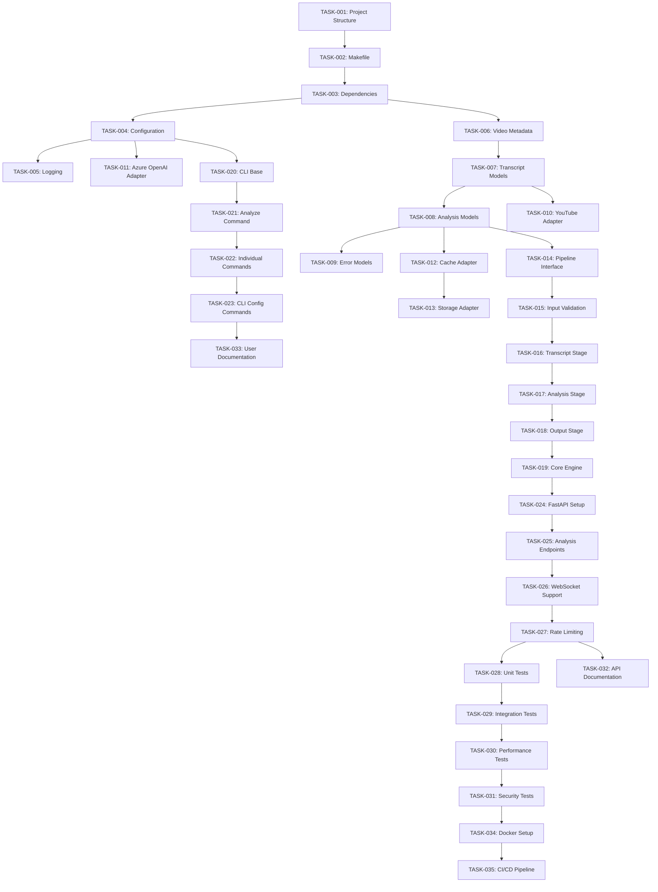

# MindTube Project - Work Breakdown Structure & Kanban Board

## Project Overview
Breaking down the MindTube implementation into small, manageable tasks for AI agent coding. Each task is designed to be completed independently and produce testable results.

## Kanban Board Status

### 🔴 Backlog
Tasks that are planned but not yet started.

### 🟡 In Progress
Tasks currently being worked on.

### 🟢 Done
Completed and tested tasks.

### ❌ Blocked
Tasks that cannot proceed due to dependencies or issues.

---

## Phase 0: Project Foundation & Tooling

### 🔴 TASK-001: Project Structure Setup
**File**: `setup_project_structure.md`
**Estimate**: 30 minutes
**Dependencies**: None
**Description**: Create basic project directory structure and configuration files
**Acceptance Criteria**:
- [ ] Create directory structure as per design document
- [ ] Initialize pyproject.toml with basic metadata
- [ ] Create .gitignore file
- [ ] Create README.md skeleton
- [ ] Verify structure matches design document

### 🔴 TASK-002: Makefile Implementation
**File**: `implement_makefile.md`
**Estimate**: 45 minutes
**Dependencies**: TASK-001
**Description**: Implement all Makefile targets referenced in roadmap
**Acceptance Criteria**:
- [ ] `make init` - Initialize project
- [ ] `make install-deps` - Install core dependencies
- [ ] `make install-dev-deps` - Install development dependencies
- [ ] `make install-api-deps` - Install FastAPI dependencies
- [ ] `make install-whisper-deps` - Install Whisper dependencies
- [ ] `make test` - Run tests
- [ ] `make lint` - Run linting
- [ ] `make typecheck` - Run type checking
- [ ] `make serve` - Start development server
- [ ] `make run-summarize`, `make run-analyze`, `make run-mindmap` - CLI commands

### 🔴 TASK-003: Core Dependencies Configuration
**File**: `setup_dependencies.md`
**Estimate**: 30 minutes
**Dependencies**: TASK-002
**Description**: Configure all required dependencies in pyproject.toml
**Acceptance Criteria**:
- [ ] Add youtube-transcript-api dependency
- [ ] Add openai dependency for Azure OpenAI
- [ ] Add typer[all] for CLI
- [ ] Add pydantic for data validation
- [ ] Add pytest, ruff, mypy for development
- [ ] Add fastapi, uvicorn for API
- [ ] Verify all dependencies install correctly

### 🔴 TASK-004: Configuration System
**File**: `implement_config_system.md`
**Estimate**: 60 minutes
**Dependencies**: TASK-003
**Description**: Implement configuration management system
**Acceptance Criteria**:
- [ ] Create Config dataclass with Azure OpenAI settings
- [ ] Support environment variables
- [ ] Support config file (~/.mindtube/config.yaml)
- [ ] Implement config validation
- [ ] Add default values
- [ ] Create config loading utility
- [ ] Add unit tests for config system

### 🔴 TASK-005: Basic Logging Setup
**File**: `setup_logging.md`
**Estimate**: 30 minutes
**Dependencies**: TASK-004
**Description**: Implement structured logging system
**Acceptance Criteria**:
- [ ] Configure logging with structured format
- [ ] Support different log levels
- [ ] Log to file and console
- [ ] Add correlation IDs for request tracking
- [ ] Test logging configuration

---

## Phase 1: Core Data Models

### 🔴 TASK-006: Video Metadata Model
**File**: `implement_video_metadata_model.md`
**Estimate**: 45 minutes
**Dependencies**: TASK-003
**Description**: Implement VideoMetadata dataclass and validation
**Acceptance Criteria**:
- [ ] Create VideoMetadata dataclass
- [ ] Add Pydantic validation
- [ ] Include all fields from design document
- [ ] Add JSON serialization/deserialization
- [ ] Create unit tests
- [ ] Add docstrings and type hints

### 🔴 TASK-007: Transcript Models
**File**: `implement_transcript_models.md`
**Estimate**: 45 minutes
**Dependencies**: TASK-006
**Description**: Implement Transcript and TranscriptSegment models
**Acceptance Criteria**:
- [ ] Create TranscriptSegment dataclass
- [ ] Create Transcript dataclass
- [ ] Add TranscriptSource enum
- [ ] Implement validation for timing data
- [ ] Add methods for text extraction
- [ ] Create unit tests
- [ ] Add JSON serialization support

### 🔴 TASK-008: Analysis Result Models
**File**: `implement_analysis_models.md`
**Estimate**: 60 minutes
**Dependencies**: TASK-007
**Description**: Implement Summary, KeyIdea, Mindmap, and VideoAnalysis models
**Acceptance Criteria**:
- [ ] Create Summary dataclass
- [ ] Create KeyIdea dataclass
- [ ] Create Mindmap dataclass with Mermaid support
- [ ] Create VideoAnalysis composite model
- [ ] Add validation for all models
- [ ] Implement JSON serialization
- [ ] Create unit tests
- [ ] Add model conversion utilities

### 🔴 TASK-009: Error Models
**File**: `implement_error_models.md`
**Estimate**: 30 minutes
**Dependencies**: TASK-008
**Description**: Implement custom exception classes and error responses
**Acceptance Criteria**:
- [ ] Create base MindTubeException
- [ ] Create specific exceptions (TranscriptNotAvailable, etc.)
- [ ] Create ErrorResponse model
- [ ] Add error codes enumeration
- [ ] Implement error serialization
- [ ] Create unit tests

---

## Phase 2: External Service Adapters

### 🔴 TASK-010: YouTube Transcript Adapter
**File**: `implement_youtube_adapter.md`
**Estimate**: 90 minutes
**Dependencies**: TASK-007, TASK-009
**Description**: Implement YouTube transcript extraction using youtube_transcript_api
**Acceptance Criteria**:
- [ ] Create YouTubeAdapter class
- [ ] Implement get_transcript method
- [ ] Handle manual vs auto-generated transcripts
- [ ] Support multiple languages
- [ ] Implement proper error handling
- [ ] Add retry logic with exponential backoff
- [ ] Create unit tests with mocked responses
- [ ] Add integration tests with real YouTube videos

### 🔴 TASK-011: Azure OpenAI Adapter
**File**: `implement_azure_openai_adapter.md`
**Estimate**: 90 minutes
**Dependencies**: TASK-004, TASK-009
**Description**: Implement Azure OpenAI integration for text analysis
**Acceptance Criteria**:
- [ ] Create AzureOpenAIAdapter class
- [ ] Implement generate_summary method
- [ ] Implement extract_key_ideas method
- [ ] Implement generate_mindmap method
- [ ] Add proper error handling and retries
- [ ] Implement rate limiting
- [ ] Add token counting and cost tracking
- [ ] Create unit tests with mocked responses
- [ ] Add integration tests with real Azure OpenAI

### 🔴 TASK-012: Cache Adapter
**File**: `implement_cache_adapter.md`
**Estimate**: 75 minutes
**Dependencies**: TASK-008
**Description**: Implement multi-level caching system
**Acceptance Criteria**:
- [ ] Create CacheAdapter interface
- [ ] Implement FileSystemCache
- [ ] Implement MemoryCache
- [ ] Add cache key generation
- [ ] Implement TTL management
- [ ] Add cache invalidation
- [ ] Support compression for large data
- [ ] Create unit tests
- [ ] Add cache performance tests

### 🔴 TASK-013: Storage Adapter
**File**: `implement_storage_adapter.md`
**Estimate**: 60 minutes
**Dependencies**: TASK-012
**Description**: Implement file system storage operations
**Acceptance Criteria**:
- [ ] Create StorageAdapter class
- [ ] Implement save/load operations
- [ ] Support multiple output formats (JSON, MD, HTML)
- [ ] Add directory management
- [ ] Implement file naming conventions
- [ ] Add error handling for disk operations
- [ ] Create unit tests
- [ ] Add file system integration tests

---

## Phase 3: Core Processing Engine

### 🔴 TASK-014: Processing Pipeline Interface
**File**: `implement_pipeline_interface.md`
**Estimate**: 45 minutes
**Dependencies**: TASK-008
**Description**: Define processing pipeline interfaces and base classes
**Acceptance Criteria**:
- [ ] Create PipelineStage abstract base class
- [ ] Define ProcessingRequest model
- [ ] Define ProcessingResult model
- [ ] Create Pipeline orchestrator class
- [ ] Add stage registration mechanism
- [ ] Implement error propagation
- [ ] Create unit tests for interfaces

### 🔴 TASK-015: Input Validation Stage
**File**: `implement_input_validation_stage.md`
**Estimate**: 60 minutes
**Dependencies**: TASK-014
**Description**: Implement URL validation and video metadata extraction
**Acceptance Criteria**:
- [ ] Create InputValidationStage class
- [ ] Validate YouTube URL formats
- [ ] Extract video ID from various URL formats
- [ ] Check video accessibility
- [ ] Gather basic metadata
- [ ] Implement comprehensive error handling
- [ ] Create unit tests with various URL formats
- [ ] Add integration tests

### 🔴 TASK-016: Transcript Acquisition Stage
**File**: `implement_transcript_stage.md`
**Estimate**: 75 minutes
**Dependencies**: TASK-015, TASK-010, TASK-012
**Description**: Implement transcript acquisition with caching
**Acceptance Criteria**:
- [ ] Create TranscriptStage class
- [ ] Integrate with YouTubeAdapter
- [ ] Implement cache checking
- [ ] Add fallback mechanisms
- [ ] Handle multiple languages
- [ ] Implement transcript quality scoring
- [ ] Create unit tests
- [ ] Add integration tests with caching

### 🔴 TASK-017: Analysis Stage
**File**: `implement_analysis_stage.md`
**Estimate**: 90 minutes
**Dependencies**: TASK-016, TASK-011
**Description**: Implement LLM-based content analysis
**Acceptance Criteria**:
- [ ] Create AnalysisStage class
- [ ] Integrate with AzureOpenAIAdapter
- [ ] Implement summary generation
- [ ] Implement key ideas extraction
- [ ] Implement mindmap generation
- [ ] Add prompt management
- [ ] Handle large transcripts (chunking)
- [ ] Create unit tests
- [ ] Add integration tests

### 🔴 TASK-018: Output Formatting Stage
**File**: `implement_output_stage.md`
**Estimate**: 60 minutes
**Dependencies**: TASK-017, TASK-013
**Description**: Implement output formatting and saving
**Acceptance Criteria**:
- [ ] Create OutputStage class
- [ ] Support JSON output format
- [ ] Support Markdown output format
- [ ] Support HTML output format
- [ ] Implement template system
- [ ] Add file saving capabilities
- [ ] Create unit tests
- [ ] Add format validation tests

### 🔴 TASK-019: Core Engine Integration
**File**: `implement_core_engine.md`
**Estimate**: 75 minutes
**Dependencies**: TASK-018
**Description**: Implement main MindTubeEngine orchestrator
**Acceptance Criteria**:
- [ ] Create MindTubeEngine class
- [ ] Integrate all pipeline stages
- [ ] Implement async processing
- [ ] Add progress tracking
- [ ] Implement error recovery
- [ ] Add performance monitoring
- [ ] Create comprehensive unit tests
- [ ] Add end-to-end integration tests

---

## Phase 4: CLI Interface

### 🔴 TASK-020: CLI Base Framework
**File**: `implement_cli_base.md`
**Estimate**: 60 minutes
**Dependencies**: TASK-004
**Description**: Set up Typer CLI framework and common utilities
**Acceptance Criteria**:
- [ ] Create main CLI app with Typer
- [ ] Implement common options (verbose, quiet, config)
- [ ] Add global error handling
- [ ] Implement progress indicators
- [ ] Add output formatting utilities
- [ ] Create CLI configuration loading
- [ ] Add basic help and version commands
- [ ] Create unit tests for CLI utilities

### 🔴 TASK-021: Analyze Command
**File**: `implement_analyze_command.md`
**Estimate**: 75 minutes
**Dependencies**: TASK-020, TASK-019
**Description**: Implement the main analyze CLI command
**Acceptance Criteria**:
- [ ] Create analyze command with all options
- [ ] Integrate with MindTubeEngine
- [ ] Support all output formats
- [ ] Implement file saving
- [ ] Add progress reporting
- [ ] Handle interruption gracefully
- [ ] Create unit tests
- [ ] Add CLI integration tests

### 🔴 TASK-022: Individual Commands
**File**: `implement_individual_commands.md`
**Estimate**: 90 minutes
**Dependencies**: TASK-021
**Description**: Implement transcript, summarize, and mindmap commands
**Acceptance Criteria**:
- [ ] Create transcript command
- [ ] Create summarize command
- [ ] Create mindmap command
- [ ] Share common functionality with analyze
- [ ] Support command-specific options
- [ ] Add proper error handling
- [ ] Create unit tests for each command
- [ ] Add CLI integration tests

### 🔴 TASK-023: CLI Configuration Commands
**File**: `implement_cli_config_commands.md`
**Estimate**: 45 minutes
**Dependencies**: TASK-022
**Description**: Implement configuration management commands
**Acceptance Criteria**:
- [ ] Create config show command
- [ ] Create config set command
- [ ] Create config validate command
- [ ] Add config file initialization
- [ ] Implement secure credential handling
- [ ] Create unit tests
- [ ] Add CLI integration tests

---

## Phase 5: REST API

### 🔴 TASK-024: FastAPI Application Setup
**File**: `implement_fastapi_setup.md`
**Estimate**: 60 minutes
**Dependencies**: TASK-019
**Description**: Set up FastAPI application with basic configuration
**Acceptance Criteria**:
- [ ] Create FastAPI app factory
- [ ] Configure CORS
- [ ] Add request/response middleware
- [ ] Implement error handlers
- [ ] Add health check endpoint
- [ ] Configure OpenAPI documentation
- [ ] Add request logging
- [ ] Create basic API tests

### 🔴 TASK-025: Analysis Endpoints
**File**: `implement_analysis_endpoints.md`
**Estimate**: 90 minutes
**Dependencies**: TASK-024
**Description**: Implement main analysis API endpoints
**Acceptance Criteria**:
- [ ] Create POST /analyze endpoint
- [ ] Create GET /transcript endpoint
- [ ] Create POST /summarize endpoint
- [ ] Create POST /mindmap endpoint
- [ ] Add request validation
- [ ] Implement async processing
- [ ] Add proper error responses
- [ ] Create API integration tests

### 🔴 TASK-026: WebSocket Support
**File**: `implement_websocket_support.md`
**Estimate**: 75 minutes
**Dependencies**: TASK-025
**Description**: Add WebSocket support for real-time progress updates
**Acceptance Criteria**:
- [ ] Create WebSocket endpoint
- [ ] Implement progress streaming
- [ ] Add connection management
- [ ] Handle client disconnections
- [ ] Add authentication if needed
- [ ] Create WebSocket tests
- [ ] Add client example code

### 🔴 TASK-027: API Rate Limiting
**File**: `implement_api_rate_limiting.md`
**Estimate**: 45 minutes
**Dependencies**: TASK-026
**Description**: Implement rate limiting and request throttling
**Acceptance Criteria**:
- [ ] Add rate limiting middleware
- [ ] Configure limits per endpoint
- [ ] Implement user-based limiting
- [ ] Add rate limit headers
- [ ] Handle rate limit exceeded errors
- [ ] Create rate limiting tests
- [ ] Add monitoring metrics

---

## Phase 6: Testing & Quality Assurance

### 🔴 TASK-028: Unit Test Suite Completion
**File**: `complete_unit_tests.md`
**Estimate**: 120 minutes
**Dependencies**: All implementation tasks
**Description**: Ensure comprehensive unit test coverage
**Acceptance Criteria**:
- [ ] Achieve >90% code coverage
- [ ] Test all error conditions
- [ ] Mock all external dependencies
- [ ] Add property-based tests where appropriate
- [ ] Create test fixtures and utilities
- [ ] Add performance benchmarks
- [ ] Verify all tests pass consistently

### 🔴 TASK-029: Integration Test Suite
**File**: `implement_integration_tests.md`
**Estimate**: 90 minutes
**Dependencies**: TASK-028
**Description**: Create comprehensive integration tests
**Acceptance Criteria**:
- [ ] Test YouTube transcript extraction
- [ ] Test Azure OpenAI integration
- [ ] Test end-to-end workflows
- [ ] Test CLI commands
- [ ] Test API endpoints
- [ ] Add test data management
- [ ] Create CI/CD test pipeline

### 🔴 TASK-030: Performance Testing
**File**: `implement_performance_tests.md`
**Estimate**: 75 minutes
**Dependencies**: TASK-029
**Description**: Create performance and load tests
**Acceptance Criteria**:
- [ ] Test processing time targets
- [ ] Test memory usage
- [ ] Test concurrent request handling
- [ ] Test cache performance
- [ ] Add performance regression tests
- [ ] Create load testing scenarios
- [ ] Document performance baselines

### 🔴 TASK-031: Security Testing
**File**: `implement_security_tests.md`
**Estimate**: 60 minutes
**Dependencies**: TASK-030
**Description**: Implement security validation and testing
**Acceptance Criteria**:
- [ ] Test input validation
- [ ] Test authentication/authorization
- [ ] Test rate limiting
- [ ] Validate credential handling
- [ ] Test for common vulnerabilities
- [ ] Add security scanning
- [ ] Document security measures

---

## Phase 7: Documentation & Deployment

### 🔴 TASK-032: API Documentation
**File**: `create_api_documentation.md`
**Estimate**: 60 minutes
**Dependencies**: TASK-027
**Description**: Create comprehensive API documentation
**Acceptance Criteria**:
- [ ] Complete OpenAPI specification
- [ ] Add endpoint examples
- [ ] Document error responses
- [ ] Create authentication guide
- [ ] Add rate limiting documentation
- [ ] Include WebSocket documentation
- [ ] Test documentation accuracy

### 🔴 TASK-033: User Documentation
**File**: `create_user_documentation.md`
**Estimate**: 90 minutes
**Dependencies**: TASK-023
**Description**: Create user guides and tutorials
**Acceptance Criteria**:
- [ ] Complete README with examples
- [ ] CLI usage guide
- [ ] Configuration guide
- [ ] Troubleshooting guide
- [ ] FAQ section
- [ ] Video tutorials (optional)
- [ ] Installation instructions

### 🔴 TASK-034: Docker Configuration
**File**: `implement_docker_setup.md`
**Estimate**: 60 minutes
**Dependencies**: TASK-031
**Description**: Create Docker configuration for deployment
**Acceptance Criteria**:
- [ ] Create optimized Dockerfile
- [ ] Create docker-compose.yml
- [ ] Add environment configuration
- [ ] Implement health checks
- [ ] Add volume management
- [ ] Create deployment scripts
- [ ] Test Docker deployment

### 🔴 TASK-035: CI/CD Pipeline
**File**: `implement_cicd_pipeline.md`
**Estimate**: 75 minutes
**Dependencies**: TASK-034
**Description**: Set up continuous integration and deployment
**Acceptance Criteria**:
- [ ] Create GitHub Actions workflow
- [ ] Add automated testing
- [ ] Add code quality checks
- [ ] Implement automated deployment
- [ ] Add security scanning
- [ ] Create release automation
- [ ] Test pipeline thoroughly

---

## Task Dependencies Graph

## Kanban Board Management

### Daily Workflow
1. **Morning**: Review blocked tasks, update task status
2. **Development**: Move tasks from Backlog → In Progress → Done
3. **Evening**: Update progress, identify blockers

### Task Status Updates
- **Backlog → In Progress**: When starting work on a task
- **In Progress → Done**: When all acceptance criteria are met and tested
- **Any → Blocked**: When dependencies or issues prevent progress
- **Blocked → Backlog**: When blockers are resolved

### Quality Gates
Each task must meet these criteria before moving to Done:
- [ ] All acceptance criteria completed
- [ ] Unit tests written and passing
- [ ] Code follows project standards
- [ ] Documentation updated
- [ ] Integration tests passing (where applicable)

### Estimation Guidelines
- **30 minutes**: Simple configuration or model creation
- **45-60 minutes**: Medium complexity implementation
- **75-90 minutes**: Complex integration or API work
- **120+ minutes**: Comprehensive testing or documentation

### Risk Management
- **High Risk**: Tasks with external API dependencies (TASK-010, TASK-011)
- **Medium Risk**: Complex integration tasks (TASK-019, TASK-025)
- **Low Risk**: Configuration and documentation tasks

This WBS provides a clear roadmap for implementing MindTube with manageable, testable tasks that can be completed by AI agents or human developers.