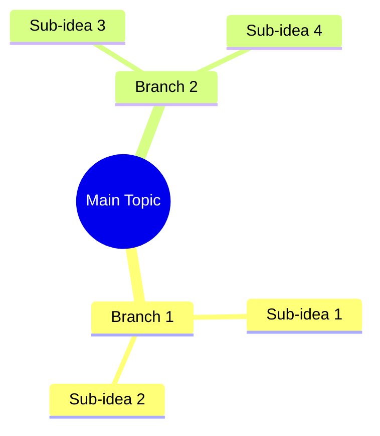

# TASK-011: Azure OpenAI Adapter

## Task Information
- **ID**: TASK-011
- **Phase**: 2 - External Service Adapters
- **Estimate**: 90 minutes
- **Dependencies**: TASK-004, TASK-009
- **Status**: 🔴 Backlog

## Description
Implement Azure OpenAI integration for text analysis including summary generation, key idea extraction, and mindmap creation. This adapter handles API communication, prompt engineering, and response parsing.

## Acceptance Criteria
- [ ] Create AzureOpenAIAdapter class
- [ ] Implement generate_summary method
- [ ] Implement extract_key_ideas method
- [ ] Implement generate_mindmap method
- [ ] Add proper error handling and retries
- [ ] Implement rate limiting
- [ ] Add token counting and cost tracking
- [ ] Create unit tests with mocked responses
- [ ] Add integration tests with real Azure OpenAI

## Implementation

### Step 1: Create mindtube/adapters/azure_openai.py

```python
"""Azure OpenAI adapter for text analysis."""

import logging
import time
from typing import List, Dict, Any, Optional
from openai import AzureOpenAI
from openai.types.chat import ChatCompletion

from mindtube.models.analysis import Summary, KeyIdea, Mindmap, VideoAnalysis
from mindtube.models.transcript import Transcript
from mindtube.models.errors import APIError, RateLimitError, ConfigurationError
from mindtube.core.config import Config

logger = logging.getLogger(__name__)

class AzureOpenAIAdapter:
    """Adapter for Azure OpenAI services."""
    
    def __init__(self, config: Config):
        """Initialize adapter with configuration."""
        self.config = config
        self.client = self._create_client()
        self.model = config.azure_openai.model_name
        self.max_retries = config.azure_openai.max_retries
        self.retry_delay = config.azure_openai.retry_delay
    
    def _create_client(self) -> AzureOpenAI:
        """Create Azure OpenAI client."""
        try:
            return AzureOpenAI(
                api_key=self.config.azure_openai.api_key,
                api_version=self.config.azure_openai.api_version,
                azure_endpoint=self.config.azure_openai.endpoint
            )
        except Exception as e:
            raise ConfigurationError("azure_openai", f"Failed to create client: {e}")
    
    def generate_summary(self, transcript: Transcript, max_length: int = 500) -> Summary:
        """Generate summary from transcript."""
        prompt = self._create_summary_prompt(transcript, max_length)
        
        response = self._make_request(prompt)
        summary_text = response.choices[0].message.content.strip()
        
        return Summary(
            text=summary_text,
            length=len(summary_text.split()),
            key_points=self._extract_key_points(summary_text)
        )
    
    def extract_key_ideas(self, transcript: Transcript, max_ideas: int = 10) -> List[KeyIdea]:
        """Extract key ideas from transcript."""
        prompt = self._create_key_ideas_prompt(transcript, max_ideas)
        
        response = self._make_request(prompt)
        ideas_text = response.choices[0].message.content.strip()
        
        return self._parse_key_ideas(ideas_text)
    
    def generate_mindmap(self, transcript: Transcript) -> Mindmap:
        """Generate mindmap from transcript."""
        prompt = self._create_mindmap_prompt(transcript)
        
        response = self._make_request(prompt)
        mermaid_code = response.choices[0].message.content.strip()
        
        # Extract title from transcript or use default
        title = f"Mindmap: {transcript.video_id}"
        
        return Mindmap(
            title=title,
            mermaid_code=mermaid_code,
            nodes=self._extract_mindmap_nodes(mermaid_code)
        )
    
    def analyze_video(self, transcript: Transcript) -> VideoAnalysis:
        """Perform complete video analysis."""
        logger.info(f"Starting analysis for video: {transcript.video_id}")
        
        # Generate all analysis components
        summary = self.generate_summary(transcript)
        key_ideas = self.extract_key_ideas(transcript)
        mindmap = self.generate_mindmap(transcript)
        
        return VideoAnalysis(
            video_id=transcript.video_id,
            summary=summary,
            key_ideas=key_ideas,
            mindmap=mindmap,
            transcript_language=transcript.language
        )
    
    def _make_request(self, prompt: str) -> ChatCompletion:
        """Make API request with retry logic."""
        for attempt in range(self.max_retries + 1):
            try:
                response = self.client.chat.completions.create(
                    model=self.model,
                    messages=[
                        {"role": "system", "content": "You are a helpful assistant that analyzes video transcripts."},
                        {"role": "user", "content": prompt}
                    ],
                    temperature=0.7,
                    max_tokens=2000
                )
                
                # Log token usage
                if response.usage:
                    logger.info(f"Token usage - Prompt: {response.usage.prompt_tokens}, "
                              f"Completion: {response.usage.completion_tokens}, "
                              f"Total: {response.usage.total_tokens}")
                
                return response
                
            except Exception as e:
                if "rate_limit" in str(e).lower():
                    if attempt < self.max_retries:
                        wait_time = self.retry_delay * (2 ** attempt)
                        logger.warning(f"Rate limited, waiting {wait_time}s before retry {attempt + 1}")
                        time.sleep(wait_time)
                        continue
                    else:
                        raise RateLimitError("Azure OpenAI", self.retry_delay)
                else:
                    logger.error(f"Azure OpenAI API error: {e}")
                    raise APIError("Azure OpenAI", str(e))
        
        raise APIError("Azure OpenAI", "Max retries exceeded")
    
    def _create_summary_prompt(self, transcript: Transcript, max_length: int) -> str:
        """Create prompt for summary generation."""
        text = transcript.get_full_text()
        
        return f"""
Please provide a concise summary of the following video transcript in approximately {max_length} words.
Focus on the main ideas, key insights, and important takeaways.

Transcript:
{text}

Summary:
"""
    
    def _create_key_ideas_prompt(self, transcript: Transcript, max_ideas: int) -> str:
        """Create prompt for key ideas extraction."""
        text = transcript.get_full_text()
        
        return f"""
Extract the top {max_ideas} key ideas from the following video transcript.
Format each idea as:
- [Category]: Brief description of the key idea

Transcript:
{text}

Key Ideas:
"""
    
    def _create_mindmap_prompt(self, transcript: Transcript) -> str:
        """Create prompt for mindmap generation."""
        text = transcript.get_full_text()
        
        return f"""
Create a Mermaid mindmap diagram from the following video transcript.
Use the format:


Focus on the main concepts and their relationships. Keep it organized and readable.

Transcript:
{text}

Mermaid Mindmap:
"""
    
    def _extract_key_points(self, summary_text: str) -> List[str]:
        """Extract key points from summary text."""
        # Simple extraction - look for bullet points or numbered items
        lines = summary_text.split('\n')
        key_points = []
        
        for line in lines:
            line = line.strip()
            if line.startswith(('-', '•', '*')) or (line and line[0].isdigit() and '.' in line):
                # Remove bullet point or number
                point = line.lstrip('-•*0123456789. ').strip()
                if point:
                    key_points.append(point)
        
        return key_points[:5]  # Limit to top 5 points
    
    def _parse_key_ideas(self, ideas_text: str) -> List[KeyIdea]:
        """Parse key ideas from response text."""
        ideas = []
        lines = ideas_text.split('\n')
        
        for line in lines:
            line = line.strip()
            if line.startswith('-') and ':' in line:
                # Parse format: - [Category]: Description
                content = line[1:].strip()
                if content.startswith('[') and ']:' in content:
                    category_end = content.find(']:')
                    category = content[1:category_end]
                    description = content[category_end + 2:].strip()
                    
                    ideas.append(KeyIdea(
                        category=category,
                        description=description,
                        importance=len(ideas) + 1  # Simple importance based on order
                    ))
        
        return ideas
    
    def _extract_mindmap_nodes(self, mermaid_code: str) -> List[str]:
        """Extract node names from Mermaid code."""
        nodes = []
        lines = mermaid_code.split('\n')
        
        for line in lines:
            line = line.strip()
            if line and not line.startswith('```') and not line.startswith('mindmap'):
                # Extract text content, removing Mermaid syntax
                node_text = line.strip()
                # Remove indentation and special characters
                node_text = node_text.lstrip(' \t-').strip()
                if node_text and not node_text.startswith('root'):
                    # Clean up node text
                    node_text = node_text.replace('((', '').replace('))', '')
                    nodes.append(node_text)
        
        return nodes
```

### Step 2: Create tests/unit/adapters/test_azure_openai.py

```python
"""Tests for Azure OpenAI adapter."""

import pytest
from unittest.mock import Mock, patch
from openai.types.chat import ChatCompletion, Choice
from openai.types.chat.chat_completion import ChatCompletionMessage
from openai.types.completion_usage import CompletionUsage

from mindtube.adapters.azure_openai import AzureOpenAIAdapter
from mindtube.models.transcript import Transcript, TranscriptSegment, TranscriptSource
from mindtube.models.errors import APIError, RateLimitError
from mindtube.core.config import Config

class TestAzureOpenAIAdapter:
    """Test Azure OpenAI adapter."""
    
    def setup_method(self):
        """Set up test fixtures."""
        self.config = Mock(spec=Config)
        self.config.azure_openai.api_key = "test_key"
        self.config.azure_openai.endpoint = "https://test.openai.azure.com/"
        self.config.azure_openai.api_version = "2023-12-01-preview"
        self.config.azure_openai.model_name = "gpt-4"
        self.config.azure_openai.max_retries = 3
        self.config.azure_openai.retry_delay = 1
        
        self.transcript = Transcript(
            video_id="test_video",
            language="en",
            segments=[
                TranscriptSegment(text="Hello world", start_time=0.0, duration=2.0),
                TranscriptSegment(text="This is a test", start_time=2.0, duration=3.0)
            ],
            source=TranscriptSource.MANUAL
        )
    
    @patch('mindtube.adapters.azure_openai.AzureOpenAI')
    def test_generate_summary_success(self, mock_client_class):
        """Test successful summary generation."""
        # Mock response
        mock_response = ChatCompletion(
            id="test_id",
            choices=[
                Choice(
                    index=0,
                    message=ChatCompletionMessage(
                        role="assistant",
                        content="This is a test summary of the video content."
                    ),
                    finish_reason="stop"
                )
            ],
            created=1234567890,
            model="gpt-4",
            object="chat.completion",
            usage=CompletionUsage(
                prompt_tokens=100,
                completion_tokens=50,
                total_tokens=150
            )
        )
        
        mock_client = Mock()
        mock_client.chat.completions.create.return_value = mock_response
        mock_client_class.return_value = mock_client
        
        # Test
        adapter = AzureOpenAIAdapter(self.config)
        summary = adapter.generate_summary(self.transcript)
        
        # Assertions
        assert summary.text == "This is a test summary of the video content."
        assert summary.length > 0
        mock_client.chat.completions.create.assert_called_once()
    
    @patch('mindtube.adapters.azure_openai.AzureOpenAI')
    def test_extract_key_ideas_success(self, mock_client_class):
        """Test successful key ideas extraction."""
        mock_response = ChatCompletion(
            id="test_id",
            choices=[
                Choice(
                    index=0,
                    message=ChatCompletionMessage(
                        role="assistant",
                        content="- [Technology]: AI and machine learning concepts\n- [Education]: Learning methodologies"
                    ),
                    finish_reason="stop"
                )
            ],
            created=1234567890,
            model="gpt-4",
            object="chat.completion"
        )
        
        mock_client = Mock()
        mock_client.chat.completions.create.return_value = mock_response
        mock_client_class.return_value = mock_client
        
        # Test
        adapter = AzureOpenAIAdapter(self.config)
        ideas = adapter.extract_key_ideas(self.transcript)
        
        # Assertions
        assert len(ideas) == 2
        assert ideas[0].category == "Technology"
        assert "AI and machine learning" in ideas[0].description
    
    @patch('mindtube.adapters.azure_openai.AzureOpenAI')
    def test_generate_mindmap_success(self, mock_client_class):
        """Test successful mindmap generation."""
        mermaid_content = """```mermaid
mindmap
  root((Main Topic))
    Branch 1
      Sub-idea 1
    Branch 2
      Sub-idea 2
```"""
        
        mock_response = ChatCompletion(
            id="test_id",
            choices=[
                Choice(
                    index=0,
                    message=ChatCompletionMessage(
                        role="assistant",
                        content=mermaid_content
                    ),
                    finish_reason="stop"
                )
            ],
            created=1234567890,
            model="gpt-4",
            object="chat.completion"
        )
        
        mock_client = Mock()
        mock_client.chat.completions.create.return_value = mock_response
        mock_client_class.return_value = mock_client
        
        # Test
        adapter = AzureOpenAIAdapter(self.config)
        mindmap = adapter.generate_mindmap(self.transcript)
        
        # Assertions
        assert "mindmap" in mindmap.mermaid_code
        assert "Main Topic" in mindmap.mermaid_code
        assert len(mindmap.nodes) > 0
    
    @patch('mindtube.adapters.azure_openai.AzureOpenAI')
    def test_rate_limit_error(self, mock_client_class):
        """Test rate limit error handling."""
        mock_client = Mock()
        mock_client.chat.completions.create.side_effect = Exception("rate_limit_exceeded")
        mock_client_class.return_value = mock_client
        
        adapter = AzureOpenAIAdapter(self.config)
        
        with pytest.raises(RateLimitError):
            adapter.generate_summary(self.transcript)
    
    @patch('mindtube.adapters.azure_openai.AzureOpenAI')
    def test_api_error(self, mock_client_class):
        """Test API error handling."""
        mock_client = Mock()
        mock_client.chat.completions.create.side_effect = Exception("API error")
        mock_client_class.return_value = mock_client
        
        adapter = AzureOpenAIAdapter(self.config)
        
        with pytest.raises(APIError):
            adapter.generate_summary(self.transcript)
```

## Implementation Steps

1. **Create Azure OpenAI adapter class**
   - Set up client configuration
   - Implement analysis methods
   - Add error handling and retries

2. **Add prompt engineering**
   - Create effective prompts for each analysis type
   - Optimize for token usage
   - Handle different content types

3. **Create comprehensive tests**
   - Unit tests with mocked responses
   - Integration tests with real API
   - Error scenario testing

4. **Add to package exports**
   - Update adapters/__init__.py
   - Export public classes

## Testing

```bash
# Run unit tests
pytest tests/unit/adapters/test_azure_openai.py -v

# Run integration tests (requires Azure OpenAI access)
pytest tests/integration/test_azure_openai.py -v -m integration
```